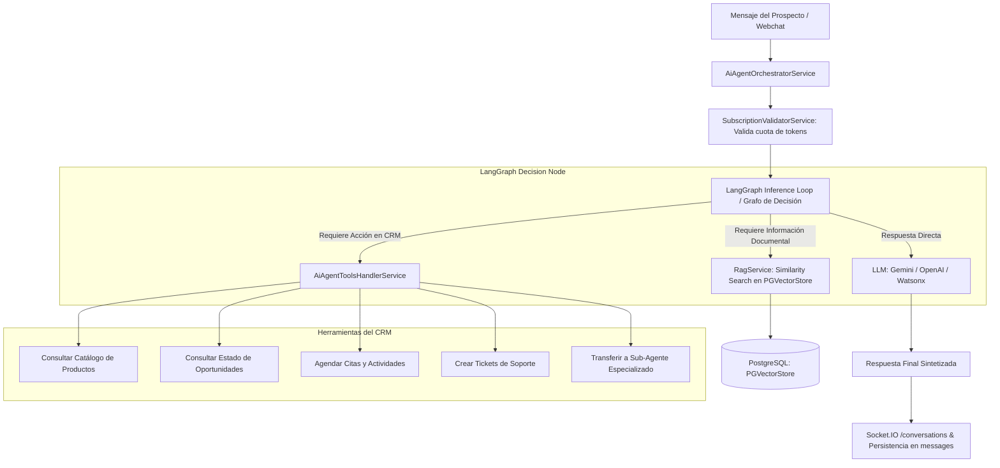

# 🤖 Motor de Inteligencia Artificial, RAG & LangGraph

## 1. Visión General de la Arquitectura de IA
CRM TIBS API incorpora una capa cognitiva de última generación diseñada para automatizar la atención comercial y soporte a través de agentes inteligentes conversacionales. El sistema integra **LangChain**, **LangGraph**, modelos de lenguaje avanzados (Google Gemini, OpenAI, IBM Watsonx) y una base de datos vectorial en PostgreSQL con **PGVectorStore** para recuperación contextual aumentada (RAG).

---

## 2. Orquestador Agéntico (`AiAgentOrchestratorService` & `AiAgentToolsHandlerService`)

### 2.1. Bucle de Inferencia con LangGraph
En lugar de depender de prompts estáticos, el agente opera mediante un grafo de estados computacional (**LangGraph**):
1. **Nodo de Análisis:** Analiza la intención del mensaje del cliente y el historial conversacional.
2. **Nodo de Herramientas (Tools Calling):** Si el modelo detecta la necesidad de ejecutar una acción en el CRM o consultar datos corporativos, genera una llamada a función estructurada.
3. **Nodo de Ejecución:** `AiAgentToolsHandlerService` ejecuta la acción de forma segura dentro del esquema del inquilino activo.
4. **Nodo de Síntesis:** El modelo incorpora los datos retornados por las herramientas y redacta una respuesta coherente con el tono definido en `AiAgentConfig`.

### 2.2. Catálogo de Herramientas Disponibles para el Agente:
* `consult_product_catalog`: Consulta productos, precios vigentes y características técnicas con soporte RAG.
* `createOpportunity` / `modifyOpportunity`: Registra o edita cotizaciones y oportunidades comerciales.
* `createActivity`: Agenda citas, llamadas o reuniones en la agenda del ejecutivo.
  * **Validación Obligatoria de Correo:** Si la actividad se relaciona a un contacto, el sistema valida estrictamente que cuente con correo electrónico asignado en el CRM. Si el contacto no tiene correo, el agente solicita amablemente el correo al cliente antes de agendar y lo persiste con `updateContact`. Queda prohibido llamar a `createActivity` sin correo.
* `checkAvailability`: Valida disponibilidad de agenda sin colisiones previo a la creación de actividades.
* `updateContact` / `registerContact`: Identifica y persiste datos de prospectos y clientes.
* `createTicket`: Levanta un ticket de soporte técnico si el usuario reporta una falla o queja.
* `requestHumanHandoff`: Deriva la conversación a un ejecutivo especializado y desactiva el bot.

## 3. Pipeline de RAG y Búsqueda Vectorial (`src/rag`)

### 3.1. Ingestión y Procesamiento de Documentos (`POST /api/rag/upload`)
1. **Recepción:** El usuario sube manuales técnicos, catálogos de servicios o políticas en formato PDF.
2. **Extracción:** Se extrae el texto puro utilizando `pdf-parse`.
3. **Chunking Semántico:** `RecursiveCharacterTextSplitter` divide el texto en fragmentos óptimos (chunk size: 1000 caracteres, chunk overlap: 200) respetando saltos de párrafo y oraciones.
4. **Generación de Embeddings Vectoriales:**
   * El sistema selecciona el modelo configurado por el inquilino:
     * **Google Generative AI:** `text-embedding-004` (vía `@langchain/google-genai`).
     * **OpenAI:** `text-embedding-3-small` (vía `@langchain/openai`).
     * **IBM Watsonx:** Adaptador nativo `CustomWatsonxEmbeddings` que negocia tokens OAuth IAM (`https://iam.cloud.ibm.com/identity/token`) y genera vectores con `ibm/slate-125m-english-rtrvr`.
5. **Persistencia Vectorial:** Los vectores y metadatos se almacenan en la tabla vectorial de PostgreSQL mediante `PGVectorStore`.

### 3.2. Consulta Semántica (`POST /api/rag/query`)
* Ante una duda del cliente, el servicio convierte la pregunta en vector y ejecuta una búsqueda por similitud de coseno (`similaritySearchWithScore`), inyectando los fragmentos documentales más relevantes en el contexto del prompt del agente.

---

## 4. Control de Consumo de Tokens y Cuotas
* Antes y después de cada invocación a los modelos generativos, `SubscriptionValidatorService` calcula el total de tokens de entrada (`prompt_tokens`) y salida (`completion_tokens`).
* Actualiza el consumo acumulado del tenant en el periodo y emite el evento `CONVERSATION_EVENTS.TENANT_CONSUMPTION_UPDATED` a través de `EventEmitter2` para actualizar en vivo el indicador de consumo en la interfaz de usuario.

### 🔄 Actualización de Encadenamiento Continuo en Agendamiento (`seguimiento`)
* **Problema Previo:** Al solicitar el correo electrónico al cliente para agendar una cita o actividad, la herramienta `updateContact` ejecutaba con éxito pero el orquestador forzaba una instrucción de respuesta `final_answer` inmediata. Esto provocaba que el bot dijera que procedería a verificar la disponibilidad pero cerraba el turno sin llamar a `checkAvailability` ni a `createActivity`.
* **Solución Implementada:**
  1. En `ai-agent-orchestrator.service.ts`: Se ajustó la inyección de directivas post-ejecución de herramientas para `updateContact` y `registerContact`. Si el cliente ya había expresado su día y horario de preferencia (ej. *"mañana a las 10 am"*), se instruye al subagente a continuar **en ese mismo turno** invocando `checkAvailability` o `createActivity` sin emitir `final_answer` anticipado.
  2. Asimismo, cuando `checkAvailability` devuelve `available: true` y el contacto ya cuenta con correo registrado, se instruye explícitamente a llamar inmediatamente a `createActivity`.
  3. Sincronización en `ai-sub-agent-migration.service.ts` y `tenant-provisioner.service.ts`: Se actualizó el prompt del subagente `seguimiento` en la base de datos para todos los esquemas de tenants activos (`tenant_teter`, etc.) para asegurar el agendamiento fluido de extremo a extremo en una sola interacción.

### 🔔 Regla Estricta: Recordatorios de Actividad Exclusivamente Internos
* **Comportamiento Ajustado:** El recordatorio creado con `createActivity` (`reminderOffsetMinutes`, por defecto 60 minutos antes) es **exclusivamente interno para la agenda y notificaciones del ejecutivo/usuario del CRM**.
* **Directiva Agéntica:** Se incorporó en `ai-agent-orchestrator.service.ts`, `ai-sub-agent-migration.service.ts` y `tenant-provisioner.service.ts` la instrucción explícita que prohíbe terminantemente al Agente de IA prometer o mencionar al cliente en su respuesta final que recibirá un recordatorio una hora antes de la cita. La confirmación al cliente se limita únicamente a informarle la fecha y hora agendada.

### 🛒 Detección Robusta de Productos en Catálogo & Flujo Mandatorio de Confirmación de Cotizaciones (`comercial`)
* **Problema Previo:**
  1. En mensajes multi-producto (ej. *"Prolene 6-0 3 piezas, Nylon 6-0 2 piezas..."*), `queryCubeProducts` filtraba en Cube.dev únicamente por la palabra más larga (`topTerms[0]`), ignorando los demás productos. Además, la consulta no incluía la dimensión `Productos.id`, lo que dejaba `productId` como `undefined` y descartaba las coincidencias en `findProductsFromSemanticLayer`. La eliminación de guiones transformaba calibres como `6-0` o `10-0` en tokens de un solo carácter que eran descartados.
  2. Al solicitar cotización, el agente generaba la oportunidad de inmediato o preguntaba de forma genérica sin confirmar cantidades individuales. Al responder el cliente afirmativamente (*"sí"*), el LLM alucinaba replicando la cantidad del primer producto a todos los productos en el PDF.
* **Solución Implementada:**
  1. **Indexación y Búsqueda Robusta en `ai-agent-tools-handler.service.ts`:**
     - Se añadió `Productos.id` a las dimensiones de consulta en Cube.dev (`dimensions: ['Productos.id', ...]`).
     - Se preservan caracteres alfanuméricos, guiones y barras (`/[^a-z0-9\s\-\/]/g`) para retener medidas como `6-0`, `10-0` y `2/0`.
     - Soporte multi-query en `consult_product_catalog`: si la consulta contiene comas o conjunciones (`y`, `e`), se segmentan las sub-consultas y se combina Cube.dev con fallback por producto hacia PostgreSQL (`findProductsByKeywords`).
  2. **Estructura Libre de Ambigüedad en Schemas (`CreateOpportunitySchema` y `ModifyOpportunitySchema`):**
     - Se incorporó `items: z.array(OpportunityItemSchema)` (`[{ nombre, cantidad, productId? }]`), vinculando de forma unívoca cada producto con su cantidad sin desfases entre arrays.
  3. **Directiva Agéntica Mandatoria de Confirmación Previa (`ai-sub-agent-migration.service.ts` & `tenant-provisioner.service.ts`):**
     - **Prohibición Estricta:** Se prohíbe terminantemente al sub-agente `comercial` invocar `createOpportunity` o generar cotizaciones sin confirmación previa del cliente.
     - **Desglose Obligatorio:** El agente debe consultar primero el catálogo con `consult_product_catalog` y responder mediante `final_answer` desglosando cada producto identificado con su cantidad detectada y su precio unitario.
     - **Bucle de Corrección:** Si el cliente modifica o corrige cualquier dato, el agente actualiza los valores y vuelve a solicitar confirmación.
     - **Confirmación Final:** Solo tras una respuesta afirmativa explícita del cliente (*"sí"*, *"correcto"*, *"adelante"*), el agente ejecuta `createOpportunity` enviando los `items` confirmados.
  4. **Auto-Sincronización en Tenants Activos:** Se sincroniza la actualización del prompt comercial en la tabla `ai_sub_agents` en todos los esquemas de tenants activos en PostgreSQL.

### 🎯 Resolución Exacta de Productos y Calibres en Cotizaciones PDF
* **Problema Identificado:**
  Al confirmar la cotización de múltiples productos con calibres o variantes similares (ej. *"Nylon 6-0 2 piezas y Nylon 10-0 5 piezas"*), el PDF generado mostraba productos incorrectos (ej. *"Nylon 3-0 5 piezas"*):
  1. `findProductsFromSemanticLayer` delegaba directamente en `queryCubeProducts`, el cual consultaba Cube.dev filtrando únicamente por la palabra más larga (`'nylon'`). Cube.dev retornaba una lista arbitraria de todos los calibres disponibles (Nylon 3-0, Nylon 4-0, etc.) sin ningún orden de relevancia o coincidencia respecto al calibre solicitado (`6-0`, `10-0`).
  2. `createOpportunity` tomaba ciegamente `matched[0].id` para cada ítem. Por tanto, tanto *"Nylon 6-0"* como *"Nylon 10-0"* se mapeaban al primer resultado del catálogo (`Nylon 3-0`), sobrescribiendo la cantidad de uno con el otro y eliminando las variantes correctas.
  3. En `consult_product_catalog`, las respuestas de texto no exponían el `ID del Producto (UUID)`, impidiendo al LLM enviar directamente el `productId` unívoco en `items`.
* **Solución Implementada:**
  1. **Algoritmo de Ranking de Relevancia (`rankProductsByRelevance`):**
     - En `ai-agent-tools-handler.service.ts`, se implementó un motor de puntuación semántica que evalúa:
       - Coincidencia exacta de nombre (+10,000 pts).
       - Coincidencia de subcadena (+5,000 pts).
       - Coincidencia de palabras clave y conjunto completo (+1,000 pts).
       - **Validación Estricta de Calibre/Medida:** Detección de patrones de medida/calibre (`6-0`, `10-0`, `3-0`, `5-0`, etc.). Si el producto coincide en el calibre exacto recibe +3,000 pts; si presenta un calibre contradictorio es penalizado severamente (-5,000 pts).
  2. **Búsqueda Directa en Base de Datos con Fallback a Cube.dev:**
     - `findProductsFromSemanticLayer` consulta prioritariamente PostgreSQL mediante `findProductsByKeywords` y ordena los resultados con `rankProductsByRelevance`. De esta forma, *"Nylon 6-0"* y *"Nylon 10-0"* se resuelven de inmediato a sus IDs exactos en milisegundos.
  3. **Exposición del UUID en Catálogo y Schemas:**
     - `consult_product_catalog` ahora expone explícitamente `ID del Producto (UUID): <uuid>` en los bloques informativos de Cube.dev y de base de datos.
     - Se actualizó el prompt del subagente comercial en `tenant-provisioner.service.ts` y `ai-sub-agent-migration.service.ts` para que incluya el `productId` en `items: [{ productId: '...', nombre: '...', cantidad: ... }]`.

  4. **Flexibilidad en Validación de `productId` (Zod Schema):**
     - En `OpportunityItemSchema`, se flexibilizó la validación de `productId` (`z.string().optional()`) para evitar que si el modelo LLM envía el nombre del producto en lugar de un UUID (ej. `{"productId": "Prolene 6-0"}`), Zod no rechace la ejecución de la herramienta con `Invalid UUID`.
     - En `AiAgentToolsHandlerService`, se incorporó validación segura mediante regex UUID (`isValidUuid`). Si `productId` no es un UUID válido, se toma como texto de búsqueda hacia `findProductsFromSemanticLayer`, resolviendo de forma infalible el producto correcto.
