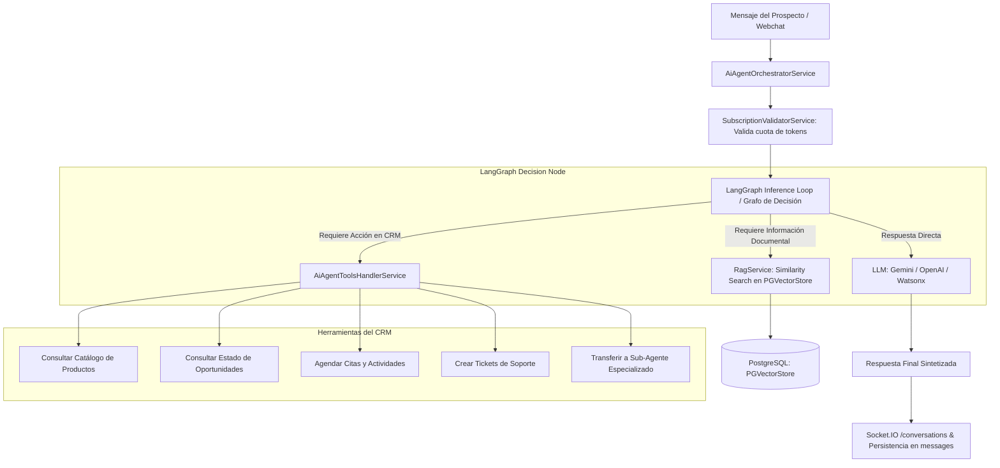

# 🤖 Motor de Inteligencia Artificial, RAG & LangGraph

## 1. Visión General de la Arquitectura de IA
CRM TIBS API incorpora una capa cognitiva de última generación diseñada para automatizar la atención comercial y soporte a través de agentes inteligentes conversacionales. El sistema integra **LangChain**, **LangGraph**, modelos de lenguaje avanzados (Google Gemini, OpenAI, IBM Watsonx) y una base de datos vectorial en PostgreSQL con **PGVectorStore** para recuperación contextual aumentada (RAG).

---

## 2. Orquestador Agéntico (`AiAgentOrchestratorService` & `AiAgentToolsHandlerService`)

### 2.1. Bucle de Inferencia con LangGraph
En lugar de depender de prompts estáticos, el agente opera mediante un grafo de estados computacional (**LangGraph**):
1. **Nodo de Análisis:** Analiza la intención del mensaje del cliente y el historial conversacional.
2. **Nodo de Herramientas (Tools Calling):** Si el modelo detecta la necesidad de ejecutar una acción en el CRM o consultar datos corporativos, genera una llamada a función estructurada.
3. **Nodo de Ejecución:** `AiAgentToolsHandlerService` ejecuta la acción de forma segura dentro del esquema del inquilino activo.
4. **Nodo de Síntesis:** El modelo incorpora los datos retornados por las herramientas y redacta una respuesta coherente con el tono definido en `AiAgentConfig`.

### 2.2. Catálogo de Herramientas Disponibles para el Agente:
* `get_products_catalog`: Consulta productos, precios vigentes y características técnicas.
* `get_client_opportunities`: Consulta el estatus de las cotizaciones y oportunidades asociadas al contacto.
* `create_crm_activity`: Agenda citas, llamadas o reuniones automáticamente en la agenda del ejecutivo.
* `create_support_ticket`: Levanta un ticket de soporte técnico si el usuario reporta una falla o queja.
* `delegate_to_subagent`: Transfiere el hilo de conversación a un sub-agente especializado configurado en `ai_sub_agents`.

---

## 3. Pipeline de RAG y Búsqueda Vectorial (`src/rag`)

### 3.1. Ingestión y Procesamiento de Documentos (`POST /api/rag/upload`)
1. **Recepción:** El usuario sube manuales técnicos, catálogos de servicios o políticas en formato PDF.
2. **Extracción:** Se extrae el texto puro utilizando `pdf-parse`.
3. **Chunking Semántico:** `RecursiveCharacterTextSplitter` divide el texto en fragmentos óptimos (chunk size: 1000 caracteres, chunk overlap: 200) respetando saltos de párrafo y oraciones.
4. **Generación de Embeddings Vectoriales:**
   * El sistema selecciona el modelo configurado por el inquilino:
     * **Google Generative AI:** `text-embedding-004` (vía `@langchain/google-genai`).
     * **OpenAI:** `text-embedding-3-small` (vía `@langchain/openai`).
     * **IBM Watsonx:** Adaptador nativo `CustomWatsonxEmbeddings` que negocia tokens OAuth IAM (`https://iam.cloud.ibm.com/identity/token`) y genera vectores con `ibm/slate-125m-english-rtrvr`.
5. **Persistencia Vectorial:** Los vectores y metadatos se almacenan en la tabla vectorial de PostgreSQL mediante `PGVectorStore`.

### 3.2. Consulta Semántica (`POST /api/rag/query`)
* Ante una duda del cliente, el servicio convierte la pregunta en vector y ejecuta una búsqueda por similitud de coseno (`similaritySearchWithScore`), inyectando los fragmentos documentales más relevantes en el contexto del prompt del agente.

---

## 4. Control de Consumo de Tokens y Cuotas
* Antes y después de cada invocación a los modelos generativos, `SubscriptionValidatorService` calcula el total de tokens de entrada (`prompt_tokens`) y salida (`completion_tokens`).
* Actualiza el consumo acumulado del tenant en el periodo y emite el evento `CONVERSATION_EVENTS.TENANT_CONSUMPTION_UPDATED` a través de `EventEmitter2` para actualizar en vivo el indicador de consumo en la interfaz de usuario.
