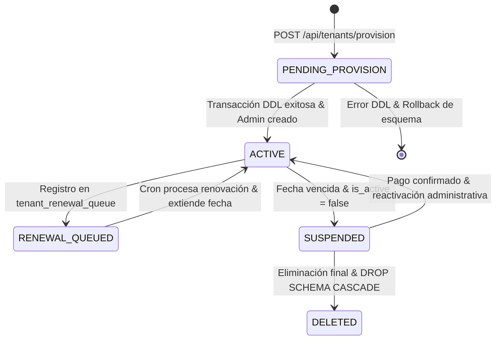

# 🚀 Aprovisionamiento de Tenants, Planes SaaS & Renovaciones

## 1. Ciclo de Vida del Inquilino (SaaS Lifecycle)
CRM TIBS API opera bajo un modelo de suscripción multitenant donde cada cliente corporativo cuenta con una base de datos aislada por esquema y una cuota mensual de procesamiento de IA ligada a su plan contratado.

---

## 2. Proceso de Aprovisionamiento Transaccional (`TenantProvisionerService`)
El método `provisionTenant(dto: ProvisionTenantDto)` orquesta la creación completa del entorno del nuevo cliente en una sola transacción PostgreSQL:

1. **Generación y Validación del Slug:**
   * Convierte el nombre de la empresa a un formato compatible con identificadores SQL: `TenantContextService.generateSlug(tenantName)`.
   * Ejemplo: `"Corporativo Azteca S.A."` $\rightarrow$ `tenant_corporativo_azteca_s_a`.
   * Verifica que no exista colisión en `information_schema.schemata`.
2. **Creación del Esquema y Definición de Tablas (DDL):**
   * Ejecuta `CREATE SCHEMA IF NOT EXISTS "${schemaName}"`.
   * Establece `SET search_path TO "${schemaName}", public`.
   * Crea las 32 tablas locales con sus índices primarios, secundarios y restricciones de llave foránea.
3. **Siembra de Catálogos y Semillas Iniciales:**
   * Inserta el pipeline por defecto: `"Ventas Generales"`.
   * Crea las etapas del embudo con sus colores y pesos: `"Prospección"`, `"Contacto Inicial"`, `"Propuesta Enviada"`, `"Negociación"`, `"Ganada"` (`stage_type: 1`), `"Perdida"` (`stage_type: 2`).
   * Registra líneas de negocio, tipos de entrega y opciones de licenciamiento estándar.
   * Inicializa el agente de IA por defecto con un prompt corporativo de asistencia.
   * Crea la mesa de ayuda principal (`helpdesks`) y sus etapas de resolución.
4. **Creación del Usuario Administrador Inicial:**
   * Genera una contraseña temporal criptográficamente aleatoria con `crypto.randomBytes(12).toString('base64')`.
   * Inserta el usuario en `"${schemaName}".users` con rol `admin`.
5. **Persistencia en el Directorio Global (`public.tenants`):**
   * Calcula la fecha de vencimiento (`next_renewal_date`) con base en los meses del plan.
   * Inserta el registro en `public.tenants` asociando el `plan_id`.
6. **Confirmación Transaccional:**
   * Ejecuta `COMMIT` y retorna las credenciales al SuperAdmin para su entrega al cliente.
   * En caso de excepción, ejecuta `ROLLBACK`, limpia el esquema residual y lanza `BadRequestException`.

---

## 3. Planes SaaS y Control de Cuotas de Tokens (`src/plans`, `src/subscriptions`)

### 3.1. Estructura de Planes (`public.plans`)
Cada plan define:
* `price`: Tarifa periódica en moneda local.
* `billing_period_months`: Frecuencia de facturación (1 mes, 3 meses, 6 meses, 12 meses).
* `tokens_limit`: Cuota mensual de tokens consumibles por los agentes de IA (ej. 50,000 / 250,000 / 1,000,000 tokens).
* `features`: Objeto JSONB que habilita o inhabilita módulos (módulos de tickets, calendarios externos, cotizador avanzado).

### 3.2. Medición y Validación de Consumo (`SubscriptionValidatorService` y `TenantsService`)
* Cada inferencia realizada por el agente de IA o el procesador RAG consulta el consumo acumulado del tenant en el período activo $[T_{\text{inicio}}, T_{\text{corte}}[$.
* Si el consumo acumulado supera `tokens_limit`:
  * Si `allow_extra === true`: Se permite la ejecución de sobreconsumo sujeto a un **Hard Cap del 100% adicional** ($2 \times \text{tokens\_limit}$).
    * Si $\text{consumo} \le 2 \times \text{tokens\_limit}$: Permite la ejecución y registra la transacción con `is_extra = true` en `transaction_history`.
    * Si $\text{consumo} > 2 \times \text{tokens\_limit}$: Bloquea con `HttpException(402, EXTRA_TOKENS_LIMIT_EXCEEDED)`.
  * Si `allow_extra === false`: Se bloquea la ejecución inmediatamente con `HttpException(402, TOKENS_LIMIT_EXCEEDED)`.
    * **Política de Absorción por Cortesía Técnica:** El desborde producido por la última llamada aprobada se cataloga como cortesía técnica absorbida por el sistema (`tokens_overage_absorbed`). Al cliente se le reporta `tokens_extra_used = 0` para evitar confusiones de facturación no autorizada.
* **Supervisión y Auditoría para SuperAdmin:**
  * `GET /api/tenants/courtesy-overages`: Reporte global consolidado de todas las organizaciones con el total de tokens de cortesía absorbidos (`total_tokens_absorbed`) y la lista de tenants en desborde.
  * `GET /api/tenants/:id/consumption`: Detalle atómico del tenant exponiendo `total_tokens_consumed`, `tokens_overage_absorbed` y `has_courtesy_overage`.
* Operaciones auditadas en `transaction_history`:
  * Inferencia de LLM (`gemini_execution`, `openai_execution`, `watsonx_execution`).
  * Ingesta y búsqueda vectorial en RAG (`rag_pdf_ingest`, `rag_similarity_search`, `rag_catalog_sync`).

---

## 4. Motor Automático de Renovaciones (`SubscriptionRenewalCron`)
Ubicado en `src/subscriptions/subscription-renewal.cron.ts`, corre periódicamente utilizando `@Cron(CronExpression.EVERY_DAY_AT_MIDNIGHT)`:
1. **Detección de Vencimientos:** Busca en `public.tenants` aquellos con `next_renewal_date <= NOW()` y `is_active = true`.
2. **Procesamiento de Cola (`public.tenant_renewal_queue`):**
   * Si existe un pago pre-autorizado o renovación encolada para el tenant:
     * Extiende `next_renewal_date` por el número de meses contratados.
     * Reinicia el contador de tokens del periodo.
     * Marca el registro de la cola como procesado.
   * Si NO existe renovación confirmada:
     * Si ha vencido el periodo de gracia, actualiza `is_active = false`.
     * Invalida la entrada en la caché LRU de `TenantMiddleware`, provocando que cualquier petición subsiguiente de los usuarios del tenant sea rechazada inmediatamente con `403 Forbidden`.

---

## 5. Gestión Avanzada de Colas de Renovación & Cambio de Planes (`src/tenants`)

### 5.1. Proyección Encadenada de Períodos en Cola
El endpoint `GET /api/tenants/:id/renewal-queue` calcula dinámicamente la secuencia cronológica de cada período registrado en `public.tenant_renewal_queue`:
* **Punto de Partida:** `baseDate = max(tenant.next_renewal_date, NOW())`.
* **Cálculo Recursivo:**
  $$\text{Período}_1: [\text{baseDate}, \text{baseDate} + \text{months}_1]$$
  $$\text{Período}_k: [\text{fin}_{k-1}, \text{fin}_{k-1} + \text{months}_k]$$
* **Metadata Expuesta:** `total_queued_periods`, `total_queued_months`, `coverage_until` e información del plan (`tokens_limit`, `price`).

### 5.2. Encolado Masivo de Períodos
* `POST /api/tenants/:id/enqueue-renewal` acepta `periodsCount` (de 1 a 60 períodos) para registrar renovaciones prepagadas en bloque.
* Si se omite `planId` o `months`, se resuelven automáticamente a partir de la configuración del plan o del tenant actual.

### 5.3. Estrategias de Cambio de Plan (`PUT /api/tenants/:id/plan`)
Permite definir mediante `UpdateTenantPlanDto`:
1. **Cambio Inmediato (`changeType: 'immediate'`):**
   * Actualiza `tenant.plan_id` de forma inmediata.
   * `immediatePolicy: 'reset_date'` $\rightarrow$ Reinicia el ciclo computando desde la fecha actual: `next_renewal_date = NOW() + months`.
   * `immediatePolicy: 'keep_current_date'` $\rightarrow$ Mantiene intacta la fecha de corte actual (upgrade de cuota sin perder vigencia pagada).
   * `updateQueuedPlans: true` $\rightarrow$ Actualiza en cascada los períodos ya encolados para que hereden el nuevo plan.
2. **Cambio al Próximo Período (`changeType: 'next_period'`):**
   * Mantiene el plan y la fecha de corte vigentes.
   * Modifica los ítems en cola (`tenant_renewal_queue`) o encola un nuevo período con el nuevo `plan_id` para que el Cron lo aplique automáticamente cuando venza el período actual.

### 5.4. Manipulación Atómica de la Cola
* `PATCH /api/tenants/renewal-queue/:queueItemId`: Modifica `plan_id` o `billing_period_months` de un ítem en cola.
* `DELETE /api/tenants/renewal-queue/:queueItemId`: Cancela un período individual.
* `DELETE /api/tenants/:id/renewal-queue`: Purgado total de la cola.

---

### 5.5. Cálculo de Fechas con Protección de Fin de Mes ("Month-End Clamping")
Para prevenir el desbordamiento involuntario de días en JavaScript al calcular renovaciones en **febrero**, **años bisiestos** o **meses de 30 días**, se implementó la utilidad `addBillingMonths` y `subtractBillingMonths` (`src/common/utils/billing-date.util.ts`):
* **Regla de Clamping:**
  $$\text{targetDay} = \min(\text{originalDay}, \text{daysInTargetMonth})$$
* **Garantías:**
  * Una suscripción con corte el **31 de Enero** avanzará al **28 de Febrero** (o **29 de Febrero** en bisiesto), en lugar de desbordar al 3 de Marzo.
  * Una suscripción con corte el **29 de Febrero (bisiesto)** con plan anual avanzará al **28 de Febrero** del siguiente año.
  * Fechas de meses con 30 días (ej. 31 de Marzo $\rightarrow$ 30 de Abril) no saltarán al primer día del mes posterior.
  * Preservación exacta de la hora, minutos y segundos del corte original.
