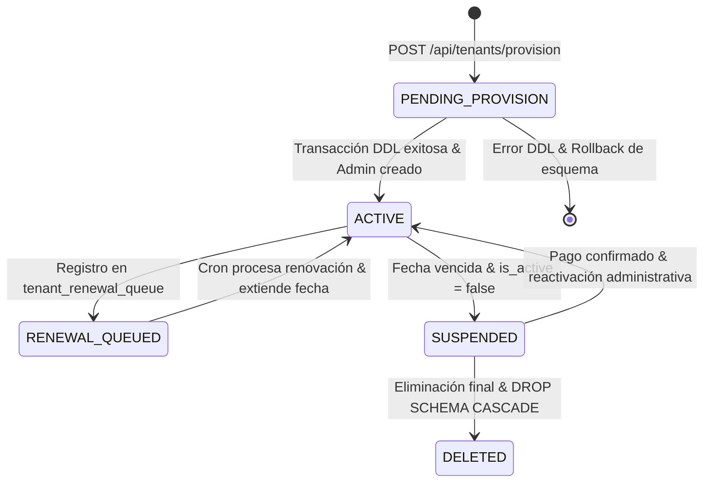

# 🚀 Aprovisionamiento de Tenants, Planes SaaS & Renovaciones

## 1. Ciclo de Vida del Inquilino (SaaS Lifecycle)
CRM TIBS API opera bajo un modelo de suscripción multitenant donde cada cliente corporativo cuenta con una base de datos aislada por esquema y una cuota mensual de procesamiento de IA ligada a su plan contratado.

---

## 2. Proceso de Aprovisionamiento Transaccional (`TenantProvisionerService`)
El método `provisionTenant(dto: ProvisionTenantDto)` orquesta la creación completa del entorno del nuevo cliente en una sola transacción PostgreSQL:

1. **Generación y Validación del Slug:**
   * Convierte el nombre de la empresa a un formato compatible con identificadores SQL: `TenantContextService.generateSlug(tenantName)`.
   * Ejemplo: `"Corporativo Azteca S.A."` $\rightarrow$ `tenant_corporativo_azteca_s_a`.
   * Verifica que no exista colisión en `information_schema.schemata`.
2. **Creación del Esquema y Definición de Tablas (DDL):**
   * Ejecuta `CREATE SCHEMA IF NOT EXISTS "${schemaName}"`.
   * Establece `SET search_path TO "${schemaName}", public`.
   * Crea las 32 tablas locales con sus índices primarios, secundarios y restricciones de llave foránea.
3. **Siembra de Catálogos y Semillas Iniciales:**
   * Inserta el pipeline por defecto: `"Ventas Generales"`.
   * Crea las etapas del embudo con sus colores y pesos: `"Prospección"`, `"Contacto Inicial"`, `"Propuesta Enviada"`, `"Negociación"`, `"Ganada"` (`stage_type: 1`), `"Perdida"` (`stage_type: 2`).
   * Registra líneas de negocio, tipos de entrega y opciones de licenciamiento estándar.
   * Inicializa el agente de IA por defecto con un prompt corporativo de asistencia.
   * Crea la mesa de ayuda principal (`helpdesks`) y sus etapas de resolución.
4. **Creación del Usuario Administrador Inicial:**
   * Genera una contraseña temporal criptográficamente aleatoria con `crypto.randomBytes(12).toString('base64')`.
   * Inserta el usuario en `"${schemaName}".users` con rol `admin`.
5. **Persistencia en el Directorio Global (`public.tenants`):**
   * Calcula la fecha de vencimiento (`next_renewal_date`) con base en los meses del plan.
   * Inserta el registro en `public.tenants` asociando el `plan_id`.
6. **Confirmación Transaccional:**
   * Ejecuta `COMMIT` y retorna las credenciales al SuperAdmin para su entrega al cliente.
   * En caso de excepción, ejecuta `ROLLBACK`, limpia el esquema residual y lanza `BadRequestException`.

---

## 3. Planes SaaS y Control de Cuotas de Tokens (`src/plans`, `src/subscriptions`)

### 3.1. Estructura de Planes (`public.plans`)
Cada plan define:
* `price`: Tarifa periódica en moneda local.
* `billing_period_months`: Frecuencia de facturación (1 mes, 3 meses, 6 meses, 12 meses).
* `tokens_limit`: Cuota mensual de tokens consumibles por los agentes de IA (ej. 50,000 / 250,000 / 1,000,000 tokens).
* `features`: Objeto JSONB que habilita o inhabilita módulos (módulos de tickets, calendarios externos, cotizador avanzado).

### 3.2. Medición y Validación de Consumo (`SubscriptionValidatorService`)
* Cada inferencia realizada por el agente de IA o el procesador RAG consulta el consumo acumulado del tenant en el periodo actual.
* Si el consumo supera `tokens_limit`:
  * Si `allow_extra === true`: Se permite la ejecución pero se registra un evento de sobreconsumo en `transaction_history` para su posterior facturación.
  * Si `allow_extra === false`: Se bloquea la ejecución de la IA con `HttpException` indicando cuota excedida y se notifica al usuario para actualizar su plan.

---

## 4. Motor Automático de Renovaciones (`SubscriptionRenewalCron`)
Ubicado en `src/subscriptions/subscription-renewal.cron.ts`, corre periódicamente utilizando `@Cron(CronExpression.EVERY_DAY_AT_MIDNIGHT)`:
1. **Detección de Vencimientos:** Busca en `public.tenants` aquellos con `next_renewal_date <= NOW()` y `is_active = true`.
2. **Procesamiento de Cola (`public.tenant_renewal_queue`):**
   * Si existe un pago pre-autorizado o renovación encolada para el tenant:
     * Extiende `next_renewal_date` por el número de meses contratados.
     * Reinicia el contador de tokens del periodo.
     * Marca el registro de la cola como procesado.
   * Si NO existe renovación confirmada:
     * Si ha vencido el periodo de gracia, actualiza `is_active = false`.
     * Invalida la entrada en la caché LRU de `TenantMiddleware`, provocando que cualquier petición subsiguiente de los usuarios del tenant sea rechazada inmediatamente con `403 Forbidden`.
