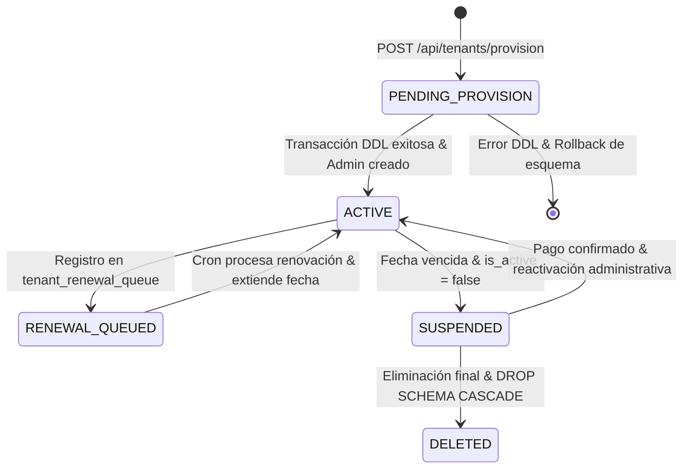

# 🚀 Aprovisionamiento de Tenants, Planes SaaS & Renovaciones

## 1. Ciclo de Vida del Inquilino (SaaS Lifecycle)
CRM TIBS API opera bajo un modelo de suscripción multitenant donde cada cliente corporativo cuenta con una base de datos aislada por esquema y una cuota mensual de procesamiento de IA ligada a su plan contratado.


```mermaid
stateDiagram-v2
    [*] --> PENDING_PROVISION: POST /api/tenants/provision
    PENDING_PROVISION --> ACTIVE: Transacción DDL exitosa & Admin creado
    PENDING_PROVISION --> [*]: Error DDL & Rollback de esquema

    ACTIVE --> RENEWAL_QUEUED: Registro en tenant_renewal_queue
    RENEWAL_QUEUED --> ACTIVE: Cron procesa renovación & extiende fecha
    ACTIVE --> SUSPENDED: Fecha vencida & is_active = false
    SUSPENDED --> ACTIVE: Pago confirmado & reactivación administrativa
    SUSPENDED --> DELETED: Eliminación final & DROP SCHEMA CASCADE
```

---

## 2. Proceso de Aprovisionamiento Transaccional (`TenantProvisionerService`)
El método `provisionTenant(dto: ProvisionTenantDto)` orquesta la creación completa del entorno del nuevo cliente en una sola transacción PostgreSQL:

1. **Generación y Validación del Slug:**
   * Convierte el nombre de la empresa a un formato compatible con identificadores SQL: `TenantContextService.generateSlug(tenantName)`.
   * Ejemplo: `"Corporativo Azteca S.A."` $\rightarrow$ `tenant_corporativo_azteca_s_a`.
   * Verifica que no exista colisión en `information_schema.schemata`.
2. **Creación del Esquema y Definición de Tablas (DDL):**
   * Ejecuta `CREATE SCHEMA IF NOT EXISTS "${schemaName}"`.
   * Establece `SET search_path TO "${schemaName}", public`.
   * Crea las 32 tablas locales con sus índices primarios, secundarios y restricciones de llave foránea.
3. **Siembra de Catálogos y Semillas Iniciales:**
   * Inserta el pipeline por defecto: `"Ventas Generales"`.
   * Crea las etapas del embudo con sus colores y pesos: `"Prospección"`, `"Contacto Inicial"`, `"Propuesta Enviada"`, `"Negociación"`, `"Ganada"` (`stage_type: 1`), `"Perdida"` (`stage_type: 2`).
   * Registra líneas de negocio, tipos de entrega y opciones de licenciamiento estándar.
   * Inicializa el agente de IA por defecto con un prompt corporativo de asistencia.
   * Crea la mesa de ayuda principal (`helpdesks`) y sus etapas de resolución.
4. **Creación del Usuario Administrador Inicial:**
   * Genera una contraseña temporal criptográficamente aleatoria con `crypto.randomBytes(12).toString('base64')`.
   * Inserta el usuario en `"${schemaName}".users` con rol `admin`.
5. **Persistencia en el Directorio Global (`public.tenants`):**
   * Calcula la fecha de vencimiento (`next_renewal_date`) con base en los meses del plan.
   * Inserta el registro en `public.tenants` asociando el `plan_id`.
6. **Confirmación Transaccional:**
   * Ejecuta `COMMIT` y retorna las credenciales al SuperAdmin para su entrega al cliente.
   * En caso de excepción, ejecuta `ROLLBACK`, limpia el esquema residual y lanza `BadRequestException`.

---

## 3. Planes SaaS y Control de Cuotas de Tokens (`src/plans`, `src/subscriptions`)

### 3.1. Estructura de Planes (`public.plans`)
Cada plan define:
* `price`: Tarifa periódica en moneda local.
* `billing_period_months`: Frecuencia de facturación (1 mes, 3 meses, 6 meses, 12 meses).
* `tokens_limit`: Cuota mensual de tokens consumibles por los agentes de IA (ej. 50,000 / 250,000 / 1,000,000 tokens).
* `features`: Objeto JSONB que habilita o inhabilita módulos (módulos de tickets, calendarios externos, cotizador avanzado).

### 3.2. Medición y Validación de Consumo (`SubscriptionValidatorService` y `TenantsService`)
* Cada inferencia realizada por el agente de IA o el procesador RAG consulta el consumo acumulado del tenant en el período activo $[T_{\text{inicio}}, T_{\text{corte}}[$.
* Si el consumo acumulado supera `tokens_limit`:
  * Si `allow_extra === true`: Se permite la ejecución de sobreconsumo sujeto a un **Hard Cap del 100% adicional** ($2 \times \text{tokens\_limit}$).
    * Si $\text{consumo} \le 2 \times \text{tokens\_limit}$: Permite la ejecución y registra la transacción con `is_extra = true` en `transaction_history`.
    * Si $\text{consumo} > 2 \times \text{tokens\_limit}$: Bloquea con `HttpException(402, EXTRA_TOKENS_LIMIT_EXCEEDED)`.
  * Si `allow_extra === false`: Se bloquea la ejecución inmediatamente con `HttpException(402, TOKENS_LIMIT_EXCEEDED)`.
    * **Política de Absorción por Cortesía Técnica e Inmutabilidad:** El desborde producido por la última llamada aprobada del plan base se cataloga como cortesía técnica absorbida por el sistema (`tokens_overage_absorbed = baseTotal - tokensLimit`). Esta cortesía es **inmutable y permanente**: si el cliente activa el consumo extra (`allow_extra = true`) con posterioridad, la cortesía previa NO se le convierte en consumo extra cobrable; su consumo extra arranca limpiamente en 0 (`tokens_extra_used = extraTotal` contabilizando exclusivamente transacciones con `is_extra = true`).
* **Supervisión y Auditoría para SuperAdmin:**
  * `GET /api/tenants/courtesy-overages`: Reporte global consolidado de todas las organizaciones con el total de tokens de cortesía absorbidos (`total_tokens_absorbed`) y la lista de tenants en desborde.
  * `GET /api/tenants/:id/consumption`: Detalle atómico del tenant exponiendo `total_tokens_consumed`, `tokens_overage_absorbed` y `has_courtesy_overage`.
* Operaciones auditadas en `transaction_history`:
  * Inferencia de LLM (`gemini_execution`, `openai_execution`, `watsonx_execution`).
  * Ingesta y búsqueda vectorial en RAG (`rag_pdf_ingest`, `rag_similarity_search`, `rag_catalog_sync`).

### 3.3. Semáforo de Concurrencia y Circuit Breaker (`TenantConcurrencyService`)
* **Control de Concurrencia por Tenant:** Regula el número de llamadas simultáneas activas al LLM (máximo 2 por organización por defecto) para eliminar condiciones de carrera y ráfagas in-flight que puedan rebasar desmedidamente la cuota contratada.
* **Cola FIFO Ilimitada:** Las peticiones adicionales se forman en una cola de espera en memoria sin límite de tamaño, evitando rechazos artificiales de tipo "429 Too Many Requests" y garantizando que la operación habitual del CRM no sufra interrupciones.
* **Circuit Breaker / Purga Inmediata ante Límite de Cuota:** Si una petición es rechazada por alcanzar el límite de tokens (`TOKENS_LIMIT_EXCEEDED` o `EXTRA_TOKENS_LIMIT_EXCEEDED` — HTTP 402), el semáforo **drena y rechaza inmediatamente todas las peticiones restantes en cola**, impidiendo que se envíen más llamadas al LLM y notificando al instante a los usuarios en espera.
* **Sincronización Atómica:** La persistencia del consumo de tokens (`recordConsumption`) se ejecuta con `await` dentro de la sesión protegida por el semáforo antes de liberar el slot, garantizando que la siguiente petición encolada consulte un saldo 100% fresco y consistente en PostgreSQL.

---

## 4. Motor Automático de Renovaciones (`SubscriptionRenewalCron`)
Ubicado en `src/subscriptions/subscription-renewal.cron.ts`, corre periódicamente utilizando `@Cron(CronExpression.EVERY_DAY_AT_MIDNIGHT)`:
1. **Detección de Vencimientos:** Busca en `public.tenants` aquellos con `next_renewal_date <= NOW()` y `is_active = true`.
2. **Procesamiento de Cola (`public.tenant_renewal_queue`):**
   * Si existe un pago pre-autorizado o renovación encolada para el tenant:
     * Extiende `next_renewal_date` por el número de meses contratados.
     * Reinicia el contador de tokens del periodo.
     * Marca el registro de la cola como procesado.
   * Si NO existe renovación confirmada:
     * Si ha vencido el periodo de gracia, actualiza `is_active = false`.
     * Invalida la entrada en la caché LRU de `TenantMiddleware`, provocando que cualquier petición subsiguiente de los usuarios del tenant sea rechazada inmediatamente con `403 Forbidden`.


---

## 5. Gestión Avanzada de Colas de Renovación & Cambio de Planes (`src/tenants`)

### 5.1. Proyección Encadenada de Períodos en Cola
El endpoint `GET /api/tenants/:id/renewal-queue` calcula dinámicamente la secuencia cronológica de cada período registrado en `public.tenant_renewal_queue`:
* **Punto de Partida:** `baseDate = max(tenant.next_renewal_date, NOW())`.
* **Cálculo Recursivo:**
  $$\text{Período}_1: [\text{baseDate}, \text{baseDate} + \text{months}_1]$$
  $$\text{Período}_k: [\text{fin}_{k-1}, \text{fin}_{k-1} + \text{months}_k]$$
* **Metadata Expuesta:** `total_queued_periods`, `total_queued_months`, `coverage_until` e información del plan (`tokens_limit`, `price`).

* **Optimización Anti-N+1 en Listado Global (`GET /api/tenants`):**
  A fin de evitar el problema clásico N+1 en la vista principal de Gestión de Organizaciones (donde el cliente emitía llamadas individuales a `GET /api/tenants/:id/renewal-queue`), el listado general `GET /api/tenants` integra directamente en una sola consulta SQL analítica:
  * **`total_queued_periods`:** Conteo consolidado de ciclos encolados en `tenant_renewal_queue`.
  * **`coverage_until`:** Fecha máxima proyectada de cobertura calculada directamente en PostgreSQL mediante aritmética de intervalos (`(total_months || ' months')::interval`) sobre la fecha base activa (`max(next_renewal_date, NOW())`), o `next_renewal_date` si la cola está vacía.
  * **`plan`:** Objeto enriquecido del plan activo asociado (`plan_id`, `plan_name`, `price`, `tokens_limit`, `billing_period_months`).

### 5.2. Encolado Masivo de Períodos
* `POST /api/tenants/:id/enqueue-renewal` acepta `periodsCount` (de 1 a 60 períodos) para registrar renovaciones prepagadas en bloque.
* Si se omite `planId` o `months`, se resuelven automáticamente a partir de la configuración del plan o del tenant actual.

### 5.3. Estrategias de Cambio de Plan (`PUT /api/tenants/:id/plan`)
Permite definir mediante `UpdateTenantPlanDto`:
1. **Cambio Inmediato (`changeType: 'immediate'`):**
   * Actualiza `tenant.plan_id` de forma inmediata.
   * `immediatePolicy: 'reset_date'` $\rightarrow$ Reinicia el ciclo computando desde la fecha actual: `next_renewal_date = NOW() + months`.
   * `immediatePolicy: 'keep_current_date'` $\rightarrow$ Mantiene intacta la fecha de corte actual (upgrade de cuota sin perder vigencia pagada).
   * `updateQueuedPlans: true` $\rightarrow$ Actualiza en cascada los períodos ya encolados para que hereden el nuevo plan.
2. **Cambio al Próximo Período (`changeType: 'next_period'`):**
   * Mantiene el plan y la fecha de corte vigentes.
   * Modifica los ítems en cola (`tenant_renewal_queue`) o encola un nuevo período con el nuevo `plan_id` para que el Cron lo aplique automáticamente cuando venza el período actual.

### 5.4. Manipulación Atómica de la Cola
* `PATCH /api/tenants/renewal-queue/:queueItemId`: Modifica `plan_id` o `billing_period_months` de un ítem en cola.
* `DELETE /api/tenants/renewal-queue/:queueItemId`: Cancela un período individual.
* `DELETE /api/tenants/:id/renewal-queue`: Purgado total de la cola.


---

### 5.5. Cálculo de Fechas con Protección de Fin de Mes ("Month-End Clamping")
Para prevenir el desbordamiento involuntario de días en JavaScript al calcular renovaciones en **febrero**, **años bisiestos** o **meses de 30 días**, se implementó la utilidad `addBillingMonths` y `subtractBillingMonths` (`src/common/utils/billing-date.util.ts`):
* **Regla de Clamping:**
  $$\text{targetDay} = \min(\text{originalDay}, \text{daysInTargetMonth})$$
* **Garantías:**
  * Una suscripción con corte el **31 de Enero** avanzará al **28 de Febrero** (o **29 de Febrero** en bisiesto), en lugar de desbordar al 3 de Marzo.
  * Una suscripción con corte el **29 de Febrero (bisiesto)** con plan anual avanzará al **28 de Febrero** del siguiente año.
  * Fechas de meses con 30 días (ej. 31 de Marzo $\rightarrow$ 30 de Abril) no saltarán al primer día del mes posterior.
  * Preservación exacta de la hora, minutos y segundos del corte original.


---

## 6. 📊 Auditoría Detallada de Consumo de Tokens por Petición & Endpoint Analítico

A fin de permitir una observabilidad exhaustiva y auditoría granular sobre el uso de recursos de Inteligencia Artificial por organización, se extendió el esquema de persistencia y el motor de reporteo de consumo.

### 6.1. Extensión del Modelo `transaction_history` por Tenant
Cada esquema de tenant almacena en `"${schemaName}".transaction_history` metadatos por cada interacción con los LLMs (Gemini, OpenAI, Azure, Watsonx) y operaciones RAG:
* **`user_id` / `user_name`:** Identificador y nombre del usuario interno en el CRM (ej. interacciones en el Webchat interno).
* **`client_id` / `client_name`:** Identificador y nombre del cliente o contacto externo (ej. WhatsApp, Messenger, Instagram).
* **`conversation_id`:** UUID de la conversación asociada a la interacción.
* **`channel`:** Canal de entrada (`'whatsapp' | 'webchat_interno' | 'messenger' | 'instagram' | 'rag'`).
* **`model_name`:** Nombre del modelo de IA ejecutado (`gemini-1.5-flash`, `gpt-4o`, `ibm/granite-3-8b-instruct`, etc.).
* **`metadata`:** Objeto JSONB extensible con detalles de la ejecución (fase agéntica: `router`, `subagent`, `rescue`, `conversation_summary`, `rag_similarity_search`, `rag_pdf_ingest`, etc.).

### 6.2. Auto-Migración en Arranque
El servicio `SubscriptionValidatorService` implementa `OnModuleInit` ejecutando `ensureAuditColumnsExist()` para aplicar de forma no destructiva e idempotente:
```sql
ALTER TABLE "${schema}".transaction_history ADD COLUMN IF NOT EXISTS user_id integer NULL;
ALTER TABLE "${schema}".transaction_history ADD COLUMN IF NOT EXISTS user_name character varying NULL;
...
```
Asimismo, `TenantProvisionerService` incluye automáticamente estas columnas en el DDL de creación de nuevos esquemas de tenant.

### 6.3. Endpoint de Desglose Analítico (`GET /api/tenants/consumption/breakdown`)
* **Acceso:** Disponible para administradores del tenant en sesión y SuperAdmin (vía query params opcionales `?schemaName=` o `?tenantId=`).
* **Alcance Temporal:** Acotado dinámicamente al ciclo de facturación vigente (`[periodStart, periodEnd]`).
* **Estructura Devuelta:**
  * **`summary`:** Resumen global de cuota del plan (`tokens_used`, `tokens_extra_used`, `tokens_limit`, `tokens_overage_absorbed`, `has_courtesy_overage`).
  * **`by_channel`:** Consumo acumulado de tokens de entrada, salida y número de peticiones por canal.
  * **`top_users`:** Top 10 usuarios internos con mayor consumo (Webchat).
  * **`top_clients`:** Top 10 clientes con mayor consumo por canales de mensajería externa.
  * **`by_model`:** Distribución del consumo por modelo LLM.
  * **`daily_timeline`:** Línea de tiempo diaria con el consumo y volumen de peticiones del período.
  * **`recent_transactions`:** Historial de las últimas 50 transacciones individuales para auditoría directa.

---

## 7. 📜 Historial de Ciclos de Facturación & Análisis Temporal Multivariante

Para permitir el análisis histórico exhaustivo del consumo de tokens y recursos en períodos pasados, se incorporó la entidad global `TenantBillingCycle` y su integración con los mecanismos de aprovisionamiento, renovación y actualización de planes.

### 7.1. Modelo Global `TenantBillingCycle` (`public.tenant_billing_cycles`)
Ubicada en el esquema `public`, registra la historia inmutable de cada período de facturación vivido por una organización:

| Columna | Tipo | Descripción |
| :--- | :--- | :--- |
| `id` | `SERIAL PRIMARY KEY` | Identificador único del ciclo. |
| `tenant_id` | `VARCHAR(63)` | Identificador del tenant. |
| `plan_id` | `INTEGER NULL` | ID del plan asignado en dicho ciclo (`FK public.plans(plan_id)`). |
| `plan_name` | `VARCHAR(255)` | Snapshot del nombre del plan en vigencia. |
| `tokens_limit` | `INTEGER` | Límite base contratado de tokens. |
| `price` | `NUMERIC(10,2)` | Precio pactado para el ciclo. |
| `billing_period_months` | `INTEGER` | Frecuencia en meses (1, 3, 6, 12). |
| `start_date` | `TIMESTAMPTZ` | Timestamp exacto de inicio del período. |
| `end_date` | `TIMESTAMPTZ` | Timestamp exacto de corte o vencimiento programado. |
| `closed_at` | `TIMESTAMPTZ NULL` | Momento exacto de finalización del ciclo (nulo mientras esté activo). |
| `status` | `VARCHAR(20)` | Estado del ciclo: `'active'`, `'closed'`, `'superseded'`. |
| `close_reason` | `VARCHAR(50) NULL` | Razón de cierre: `'renewal_cron'`, `'immediate_reset'`, `'immediate_keep_date'`, `'plan_upgrade'`, `'tenant_deleted'`. |
| `allow_extra` | `BOOLEAN` | Si el consumo extra estuvo habilitado. |
| `tokens_used_at_close` | `INTEGER` | Snapshot congelado de tokens base consumidos al cerrar. |
| `tokens_extra_used_at_close` | `INTEGER` | Snapshot congelado de tokens extra consumidos al cerrar. |
| `tokens_courtesy_at_close` | `INTEGER` | Snapshot congelado de tokens absorbidos por cortesía técnica al cerrar. |

### 7.2. Interacción con las 3 Variantes de Cambio de Plan
1. **Inmediato con Reinicio de Fecha (`changeType: 'immediate'`, `immediatePolicy: 'reset_date'`):**
   * El ciclo activo vigente se congela y se cierra (`status = 'closed'`, `closed_at = NOW()`, `close_reason = 'immediate_reset'`), guardando los tokens consumidos hasta el segundo previo al cambio.
   * Se crea e inserta inmediatamente un nuevo ciclo con `status = 'active'` desde `NOW()` hasta `NOW() + months` con los límites del nuevo plan.
2. **Inmediato Conservando Fecha de Corte (`changeType: 'immediate'`, `immediatePolicy: 'keep_current_date'`):**
   * El ciclo activo vigente **no se cierra**: se actualiza in-place (`plan_id`, `plan_name`, `tokens_limit`, `price`, `close_reason = 'immediate_keep_date'`), expandiendo inmediatamente la cuota de tokens sin alterar `end_date`.
3. **Programado al Próximo Período (`changeType: 'next_period'`):**
   * El ciclo activo vigente permanece 100% inalterado.
   * El nuevo plan se encola en `public.tenant_renewal_queue`. Cuando `SubscriptionRenewalCron` detecta el vencimiento, cierra el ciclo expirado con sus métricas congeladas y crea el nuevo ciclo activo para el plan programado.

### 7.3. Integración en el Cron de Renovaciones (`SubscriptionRenewalCron`)
Al procesar organizaciones con `next_renewal_date <= NOW()`:
* Congela el consumo final del ciclo activo y lo marca como `status = 'closed'`, `closed_at = NOW()`, `close_reason = 'renewal_cron'`.
* Si existe un período en `public.tenant_renewal_queue`, inserta atómicamente el nuevo ciclo de facturación activo en `public.tenant_billing_cycles` con las especificaciones del plan desencolado.

### 7.4. Endpoints y Filtros Multivariantes
* `GET /api/tenants/billing-cycles`: Retorna la lista de ciclos (activos y pasados) con el cálculo en tiempo real del consumo actual para el ciclo en curso. Acepta query params opcionales `?tenantId=` o `?schemaName=`.
* `GET /api/tenants/:id/billing-cycles`: Retorna los ciclos del tenant especificado por ID.
* `GET /api/tenants/consumption/breakdown`: Extendido con soporte de:
  * `?cycleId=`: Recupera el consumo analítico, resumen del plan y transacciones del ciclo histórico seleccionado.
  * `?startDate=` & `?endDate=`: Filtra el consumo analítico dentro de cualquier rango de fechas personalizado.
