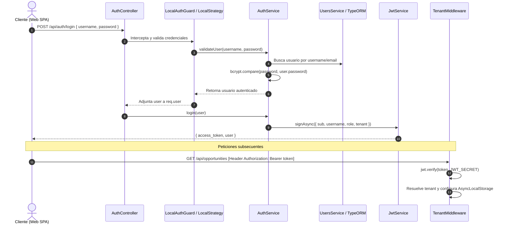

# 🔐 Autenticación, JWT & Seguridad en CRM TIBS API

## 1. Visión General del Flujo de Autenticación
El sistema implementa un esquema de autenticación basado en **Bearer Tokens JWT** sin estado, soportado por **Passport.js** y decoradores nativos de NestJS. El ciclo de vida de una solicitud autenticada involucra la validación de credenciales, emisión de token, extracción del contexto de inquilino y control de acceso basado en roles.



---

## 2. Componentes de Autenticación y Estrategias

### 2.1. LocalStrategy (`src/auth/local.strategy.ts`)
* Valida credenciales contra `AuthService.validateUser()`.
* Soporta autenticación tanto por nombre de usuario (`username`) como por correo electrónico (`email`).
* Compara el hash de la contraseña utilizando `bcrypt.compare()`.
* Rechaza el acceso con `UnauthorizedException` si el usuario no existe, las credenciales son incorrectas o la cuenta está desactivada (`isActive = false`).

### 2.2. Emisión y Payload del Token JWT
Al autenticarse con éxito, `AuthService.login()` genera un token firmado con el secreto configurado en `JWT_SECRET`:
```typescript
const payload = {
  sub: user.id,
  username: user.username,
  role: user.role,
  tenant: user.tenant_schema || 'public',
};
return {
  access_token: await this.jwtService.signAsync(payload),
  user: {
    id: user.id,
    username: user.username,
    email: user.email,
    role: user.role,
    tenant: payload.tenant,
  },
};
```

### 2.3. JwtStrategy (`src/auth/jwt.strategy.ts`)
* Configurada para extraer el token desde el encabezado estándar: `ExtractJwt.fromAuthHeaderAsBearerToken()`.
* Valida la firma del token y que no haya expirado (`ignoreExpiration: false`).
* Inyecta el usuario decodificado en `req.user` para su posterior consumo en controladores mediante el decorador `@GetUser()`.

---

## 3. Recuperación de Contraseñas (`ForgotPassword` & `ResetPassword`)
1. **Solicitud (`POST /api/auth/forgot-password`):**
   * El usuario envía su correo electrónico registrado.
   * `AuthService.forgotPassword()` genera un token aleatorio seguro utilizando `crypto.randomBytes(32).toString('hex')`.
   * Persiste `reset_password_token` y una fecha de expiración (`reset_password_expires`, TTL de 1 hora) en la entidad `User`.
   * Emite un correo electrónico a través de `MailService` con el enlace de recuperación hacia el frontend.
2. **Restablecimiento (`POST /api/auth/reset-password`):**
   * El usuario envía el token y la nueva contraseña.
   * Se verifica que el token exista y que la fecha de expiración sea mayor al momento actual (`reset_password_expires > NOW()`).
   * La nueva contraseña se cifra con `bcrypt.hash(password, 10)`.
   * Se invalidan los campos `reset_password_token` y `reset_password_expires` para impedir reuso.

---

## 4. Estrategia de Rate Limiting (`@nestjs/throttler`)
Para mitigar ataques de denegación de servicio (DoS) y fuerza bruta en credenciales, la aplicación implementa tres niveles de protección estratificada en `app.module.ts`:

| Nombre del Throttler | TTL (Tiempo de Ventana) | Límite de Peticiones | Ámbito de Aplicación |
| :--- | :---: | :---: | :--- |
| **`default`** | 60 segundos | 5,000 req | Endpoints generales autenticados de negocio. |
| **`auth`** | 60 segundos | 1,000 req (estricto) | Endpoints sensibles de autenticación (`/api/auth/*`). |
| **`webhook`** | 60 segundos | 1,000 req | Webhooks entrantes de IA y webchat. |

* Las rutas de alto tráfico o endpoints internos exentos utilizan el decorador `@SkipThrottle()`.

---

## 5. Medidas Adicionales de Seguridad
* **Helmet:** Inyección automática de cabeceras de protección (`X-DNS-Prefetch-Control`, `X-Frame-Options`, `X-Download-Options`, `X-Content-Type-Options`). La directiva `contentSecurityPolicy` se desactiva selectivamente para permitir la interfaz visual de Swagger UI.
* **CORS:** Política de orígenes cruzados restringida mediante la variable `ALLOWED_ORIGINS` con soporte explícito de credenciales (`credentials: true`).
* **Protección de Producción:** Si el entorno está configurado como `NODE_ENV=production`, la aplicación bloquea el arranque fatalmente si `DB_SYNCHRONIZE` está en `true` para evitar alteraciones accidentales del esquema en caliente.
