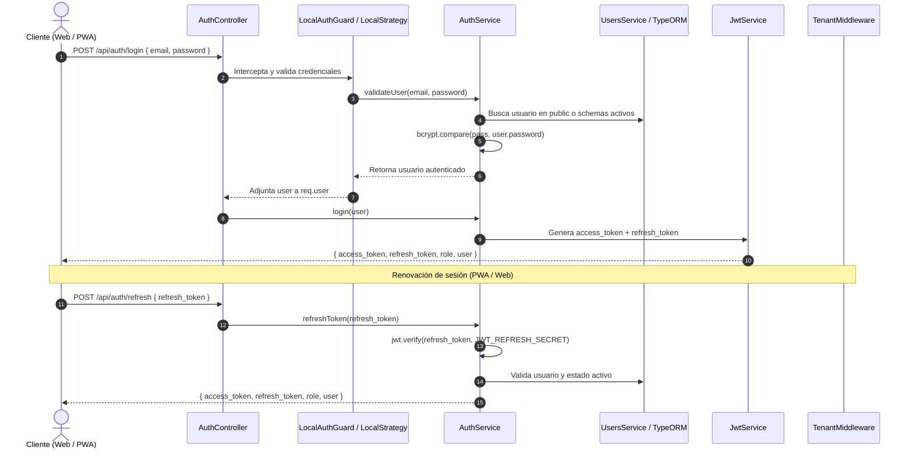

# 🔐 Autenticación, JWT & Seguridad en CRM TIBS API

## 1. Visión General del Flujo de Autenticación
El sistema implementa un esquema de autenticación robusto basado en **Tokens Duales JWT (Access Token + Refresh Token)** sin estado, soportado por **Passport.js**, interceptores HTTP y decoradores de NestJS. Diseñado específicamente para clientes Web y aplicaciones progresivas (**PWA**), permite renovación silenciosa (*silent refresh*), tolerancia ante suspensión de pestañas y sincronización en tiempo real.

```mermaid
sequenceDiagram
    autonumber
    actor Cliente as Cliente (Web / PWA)
    participant AuthCtrl as AuthController
    participant LocalGuard as LocalAuthGuard / LocalStrategy
    participant AuthSvc as AuthService
    participant UserRepo as UsersService / TypeORM
    participant JwtSvc as JwtService
    participant TenantMW as TenantMiddleware

    Cliente->>AuthCtrl: POST /api/auth/login { email, password }
    AuthCtrl->>LocalGuard: Intercepta y valida credenciales
    LocalGuard->>AuthSvc: validateUser(email, password)
    AuthSvc->>UserRepo: Busca usuario en public o schemas activos
    AuthSvc->>AuthSvc: bcrypt.compare(pass, user.password)
    AuthSvc-->>LocalGuard: Retorna usuario autenticado
    LocalGuard-->>AuthCtrl: Adjunta user a req.user
    AuthCtrl->>AuthSvc: login(user)
    AuthSvc->>JwtSvc: Genera access_token + refresh_token
    JwtSvc-->>Cliente: { access_token, refresh_token, role, user }

    Note over Cliente, TenantMW: Renovación de sesión (PWA / Web)
    Cliente->>AuthCtrl: POST /api/auth/refresh { refresh_token }
    AuthCtrl->>AuthSvc: refreshToken(refresh_token)
    AuthSvc->>AuthSvc: jwt.verify(refresh_token, JWT_REFRESH_SECRET)
    AuthSvc->>UserRepo: Valida usuario y estado activo
    AuthSvc-->>Cliente: { access_token, refresh_token, role, user }
```

---

## 2. Componentes de Autenticación y Estrategias

### 2.1. LocalStrategy (`src/auth/local.strategy.ts`)
* Valida credenciales contra `AuthService.validateUser()`.
* Soporta autenticación tanto por nombre de usuario (`username`) como por correo electrónico (`email`).
* Compara el hash de la contraseña utilizando `bcrypt.compare()`.
* Rechaza el acceso con `UnauthorizedException` si el usuario no existe, las credenciales son incorrectas o la cuenta está desactivada (`isActive = false`).

### 2.2. Emisión Dual de Tokens (Access Token + Refresh Token)
Al autenticarse con éxito en `AuthService.login()`, el sistema genera dos tokens criptográficos:
1. **Access Token:**
   * Payload: `{ sub: user.id, username: user.username, role: user.role, tenant: user.tenant, type: 'access' }`.
   * TTL: Configurado vía `JWT_EXPIRATION_TIME` (por defecto `7d` o `15m` para alta seguridad).
   * Secreto: `JWT_SECRET`.
2. **Refresh Token:**
   * Payload: `{ sub: user.id, username: user.username, role: user.role, tenant: user.tenant, type: 'refresh' }`.
   * TTL: Configurado vía `JWT_REFRESH_EXPIRATION_TIME` (por defecto `30d`).
   * Secreto: `JWT_REFRESH_SECRET` (o derivado seguro `${JWT_SECRET}_refresh`).

### 2.3. Endpoint de Renovación (`POST /api/auth/refresh`)
* Controlador: `AuthController.refresh(@Body() dto: RefreshTokenDto)`.
* Servicio: `AuthService.refreshToken(token)`.
* Valida la firma del token con `JWT_REFRESH_SECRET`, verifica que `type === 'refresh'`, confirma en base de datos que la cuenta de usuario continúe activa (`isActive: true`) y que el tenant de pertenencia esté activo, emitiendo un nuevo par de tokens rotados (*token rotation*).

### 2.4. JwtStrategy (`src/auth/jwt.strategy.ts`)
* Configurada para extraer el token desde el encabezado estándar: `ExtractJwt.fromAuthHeaderAsBearerToken()`.
* Valida la firma del token y que no haya expirado (`ignoreExpiration: false`).
* Inyecta el usuario decodificado en `req.user` con `{ id, userId, username, role, tenant }`.

### 2.5. Autenticación en WebSockets (Gateways Socket.IO)
Los gateways en tiempo real (`NotificationsGateway`, `ConversationsGateway`) aceptan y validan el token JWT tanto en el objeto de autenticación `client.handshake.auth.token` como en `client.handshake.headers.authorization`, asegurando la procedencia legítima de las conexiones antes de unirlas a salas privadas de usuario.

---

## 3. Recuperación de Contraseñas (`ForgotPassword` & `ResetPassword`)
1. **Solicitud (`POST /api/auth/forgot-password`):**
   * El usuario envía su correo electrónico registrado.
   * `AuthService.forgotPassword()` genera un token aleatorio seguro utilizando `crypto.randomBytes(32).toString('hex')`.
   * Persiste `reset_password_token` y una fecha de expiración (`reset_password_expires`, TTL de 1 hora) en la entidad `User`.
   * Emite un correo electrónico a través de `MailService` con el enlace de recuperación hacia el frontend.
2. **Restablecimiento (`POST /api/auth/reset-password`):**
   * El usuario envía el token y la nueva contraseña.
   * Se verifica que el token exista y que la fecha de expiración sea mayor al momento actual (`reset_password_expires > NOW()`).
   * La nueva contraseña se cifra con `bcrypt.hash(password, 10)`.
   * Se invalidan los campos `reset_password_token` y `reset_password_expires` para impedir reuso.

---

## 4. Estrategia de Rate Limiting (`@nestjs/throttler`)
Para mitigar ataques de denegación de servicio (DoS) y fuerza bruta en credenciales, la aplicación implementa niveles de protección estratificada:

| Nombre del Throttler | TTL (Tiempo de Ventana) | Límite de Peticiones | Ámbito de Aplicación |
| :--- | :---: | :---: | :--- |
| **`default`** | 60 segundos | 5,000 req | Endpoints generales autenticados de negocio. |
| **`auth`** | 60 segundos | 10 req | Endpoints sensibles de autenticación (`/api/auth/login`, `/forgot-password`). |
| **`auth.refresh`** | 60 segundos | 30 req | Endpoint de renovación de sesión (`/api/auth/refresh`). |
| **`webhook`** | 60 segundos | 1,000 req | Webhooks entrantes de IA y webchat. |

---

## 5. Medidas Adicionales de Seguridad y Compatibilidad PWA
* **Manejo Centralizado de Excepciones:** `GlobalExceptionFilter` intercepta `TokenExpiredError` y `JsonWebTokenError` retornando `401 Unauthorized` estandarizado.
* **Multi-tenancy Blindado:** `TenantMiddleware` valida y aísla esquemas PostgreSQL mediante `TenantContextService` (`AsyncLocalStorage`) y arroja `403 Forbidden` si la organización está inactiva.
* **Helmet & CORS:** Protección contra clickjacking, MIME sniffing y CORS configurado con `credentials: true`.
