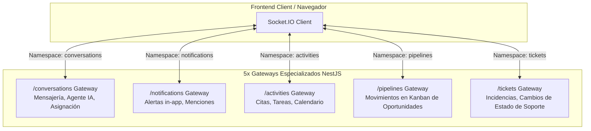

# 💬 Conversaciones, Webchat & Arquitectura WebSockets

## 1. Visión General de la Capa en Tiempo Real
CRM TIBS API adopta un diseño distribuido para eventos en vivo mediante **Socket.IO** (`@nestjs/websockets`, `@nestjs/platform-socket.io`), estructurado en **5 gateways independientes** para evitar la congestión de eventos y asegurar baja latencia en la interfaz de usuario.

---

## 2. Los 5 Gateways de WebSockets

### 2.1. Gateway de Conversaciones (`src/conversations/conversations.gateway.ts`)
* **Namespace:** `/conversations`
* **Transportes:** `websocket`, `polling` (con fallback automático).
* **Eventos Emitidos:**
  * `message_received`: Nuevo mensaje entrante de prospecto o emitido por el agente de IA / operador humano.
  * `bot_status_changed`: Notifica si el agente de IA ha sido encendido o apagado para esa conversación específica.
  * `conversation_assigned`: Notifica la asignación de un operador humano al chat.
  * `tenant_consumption_updated`: Notifica la actualización en tiempo real de los tokens consumidos por el inquilino (disparado vía listener desacoplado `@OnEvent(CONVERSATION_EVENTS.TENANT_CONSUMPTION_UPDATED)`).

### 2.2. Gateway de Notificaciones (`src/notifications/notifications.gateway.ts`)
* **Namespace:** `/notifications`
* **Propósito:** Envío instantáneo de alertas de sistema, recordatorios próximos a vencer, asignación de nuevas oportunidades o menciones internas entre colaboradores.

### 2.3. Gateway de Actividades (`src/activities/activities.gateway.ts`)
* **Namespace:** `/activities`
* **Propósito:** Sincronización en vivo del calendario interno del CRM cuando un compañero de equipo crea, edita o completa una reunión o llamada.

### 2.4. Gateway de Pipelines (`src/pipelines/pipelines.gateway.ts`)
* **Namespace:** `/pipelines`
* **Propósito:** Actualización colaborativa del tablero Kanban de oportunidades. Cuando un ejecutivo arrastra una tarjeta a otra etapa, el cambio se refleja instantáneamente en las pantallas de los demás ejecutivos sin recargar la página.

### 2.5. Gateway de Tickets (`src/tickets/tickets.gateway.ts`)
* **Namespace:** `/tickets`
* **Propósito:** Refresco en tiempo real de la cola de soporte, notificación de tickets escalados por incumplimiento de SLA y nuevos comentarios de clientes.

---

## 3. Módulo de Webchat Público (`src/webchat`)

### 3.1. Widget Incrustable
El módulo de webchat permite a los clientes de CRM TIBS integrar un widget de chat en vivo en sus sitios web corporativos mediante un fragmento de JavaScript ligero:
* `POST /api/webchat/init`: Inicializa una sesión anónima o identificada para el visitante. Crea o recupera un registro en `conversations` vinculado al canal `'webchat'`.
* `POST /api/webchat/message`: Ingesta el mensaje del visitante sin requerir token JWT, aplicando el rate limiter específico para webhooks (`1000 req/min`).

### 3.2. Handoff Humano-IA (Alternancia de Control)
* Por defecto, las conversaciones entrantes son atendidas por el Agente de IA (`bot_active = true`).
* Un operador humano puede tomar el control de la conversación en cualquier momento mediante `PATCH /api/conversations/:id/toggle-bot`.
* Al apagarse el bot, el sistema silencia las respuestas del LLM y permite que el ejecutivo responda manualmente. Si el ejecutivo se desconecta o libera el chat, puede reactivar el bot con un solo clic.

## 4. Asistente de Webchat Interno & Ejecución de Acciones (`WebchatActionExecutorService`)
El Webchat Interno asiste a ejecutivos y administradores para consultar métricas y ejecutar acciones operativas en lenguaje natural:
* **Flujos Multi-Turno:** Si una solicitud carece de parámetros indispensables (fecha, detalle, tipo de actividad o correo de contacto), el motor detiene la ejecución y solicita los datos pendientes conservando el contexto en turnos sucesivos.
* **Validación Obligatoria de Correo en Contactos:** Al programar actividades (`createActivity`) vinculadas a un contacto (`clientId`, `contacto` o `contactIds`), el sistema valida obligatoriamente que dicho contacto tenga un correo electrónico registrado en el CRM. Si carece de correo, el asistente solicita explícitamente el correo antes de agendar. Cuando el usuario proporciona el correo (en el mismo mensaje o en turnos sucesivos), el sistema actualiza y persiste el correo en el registro del contacto (`Client`) y completa la creación de la actividad automáticamente.

## 5. Canales Externos (WhatsApp Cloud API, Meta, Instagram & Messenger)

### 5.1. Regla de Ventana de Atención (24h con Margen de Seguridad de 23 Horas)
Meta impone en WhatsApp Cloud API la *Customer Service Window* de 24 horas a partir del último mensaje entrante del cliente (`lastCustomerMessageAt`).
Para evitar fallos de entrega silenciosos y rechazos de Meta en tránsito (Error `#131047: Re-engagement message`), CRM TIBS API aplica una política preventiva con **margen de seguridad de 23 horas** (`WHATSAPP_WINDOW_HOURS_MARGIN = 23`):
* `isCustomerWindowActive(23)`: Evalúa si la conversación está dentro del margen seguro de 23 horas.
* **Bloqueo Preventivo:** Si la ventana expiró, el endpoint `POST /api/conversations/:id/messages` rechaza mensajes de texto libre con HTTP `400 Bad Request` (`code: 'WHATSAPP_24H_WINDOW_EXPIRED'`), evitando guardar mensajes no entregados en la base de datos.
* **Enriquecimiento de Listas:** `GET /api/conversations` devuelve para cada conversación `is24HourWindowActive`, `windowExpiresAt` y `safetyWindowExpiresAt`.

### 5.2. Plantillas Oficiales de Meta (WhatsApp Message Templates)
* `GET /api/conversations/:id/templates`: Retorna **únicamente la plantilla base configurada** (con su `id` oficial de Meta, `name` y componentes `BODY`), evitando sobrecargar al operador con plantillas ajenas al inicio de chat. Admite `?all=true` para consultar el catálogo completo de Meta si fuera necesario.
* `POST /api/conversations/:id/template-message`: Envía una plantilla pre-aprobada (`type: 'template'`) con sus componentes/variables a Meta Graph API. Registra el mensaje en la tabla `messages` con `messageType: 'template'`, `status: 'sent'`, el `wamid` devuelto por Meta, y almacena en `content` el **texto real e interpolado de la plantilla** (con sus variables sustituidas, encabezado y pie de página), garantizando que la burbuja del chat muestre el mensaje legible y exacto enviado al cliente.

### 5.3. Rastreo de Estados de Entrega (Webhooks `statuses`)
* La tabla `messages` incluye `status` (`'pending' | 'sent' | 'delivered' | 'read' | 'failed'`), `messageType`, `externalMessageId` (`wamid`) y `errorMessage`.
* `ConversationsService.handleIncomingWebhook`: Procesa las notificaciones de estado de Meta (`value.statuses`), actualiza el registro en la base de datos del tenant y emite en tiempo real a los navegadores mediante el WebSocket Gateway (`message_status_updated`).

### 5.4. Plantilla Base de Inicio y Sincronización Directa con Meta Graph API
Para iniciar conversaciones o reabrir el canal tras la expiración de la ventana de 23h, CRM TIBS implementa el concepto de **Plantilla Base** persistida en la tabla dedicada `whatsapp_templates`:
* **Tabla `whatsapp_templates`:** Guarda las plantillas vinculadas a cada configuración de canal (`channelConfigId`), con `templateId` (Meta ID), `name` (estrictamente inmutable: `crm_inicio_conversacion`), `category` (`'MARKETING'`), `language` (`'es'`), `bodyText` (por defecto `'Hola {{1}}, ¿cómo estás? Me comunico contigo para dar seguimiento y revisar lo siguiente:'`), `status` (`'APPROVED' | 'PENDING' | 'REJECTED'`) y la bandera `isBase = true`.
* **Soporte de Variables Estrictamente Delimitado (Máximo 3):**
  * `{{1}}`: Nombre del contacto o cliente (`client.nombre` o `conversation.clientName`).
  * `{{2}}`: Nombre de la empresa asociada al contacto en el CRM (`client.company.nombre` o `client.empresa`, ej. *"TIBS MX"*). Si el contacto no tiene empresa vinculada, se resuelve y envía **vacío** (con sanitización transparente para evitar errores de parámetro vacío en Meta Graph API).
  * `{{3}}`: Nombre del asesor, ejecutivo de cuenta o usuario logueado (`client.ejecutivo.username` o `user.username`).
  * La API valida que las variables sean estrictamente correlativas y no permite más de 3 variables.
* **Edición con Impacto Directo en Meta:**
  * `PUT /api/conversations/channels/:channelConfigId/base-template`:
    * **Restricción estricta de campos:** Solo permite modificar `headerText`, `bodyText` y `footerText`. El nombre técnico es obligatorio e inmutable (`crm_inicio_conversacion`) de acuerdo a las directivas de Meta.
    * Si la plantilla ya tiene `templateId`: envía `POST https://graph.facebook.com/v19.0/{templateId}` con los nuevos componentes (`BODY`, `HEADER`, `FOOTER`).
    * Si es nueva: envía `POST https://graph.facebook.com/v19.0/{wabaId}/message_templates` con nombre `crm_inicio_conversacion`, categoría `MARKETING`, idioma `es` y componentes con ejemplos dinámicos realistas (`Juan Pérez`, `TIBS MX`, `Carlos Asesor`). Guarda el ID oficial retornado por Meta.
  * `GET /api/conversations/channels/:channelConfigId/base-template`: Consulta la plantilla base del canal y sincroniza en vivo su estado (`status`), componentes y categoría (`MARKETING`) desde Meta Graph API.
  * `POST /api/conversations/channels/:channelConfigId/select-base-template`: Permite asignar una plantilla aprobada preexistente en Meta como la plantilla base del canal.
* **Uso en Conversación:**
  * `GET /api/conversations/:id/base-template`: Obtiene la plantilla base y resuelve dinámicamente las 3 variables con los datos reales del contacto (`resolvedVariables`: `1` -> contacto, `2` -> empresa del contacto o `""`, `3` -> ejecutivo/asesor).
  * `GET /api/conversations/:id/templates`: Retorna exclusivamente la plantilla base con su ID de Meta.
  * `POST /api/conversations/:id/template-message`: Si no se pasan componentes explícitos, autocompleta automáticamente las variables con el nombre del contacto, la empresa vinculada al contacto (`TIBS MX` o vacía si no existe) y el asesor asignado. Sanitiza parámetros vacíos para que Meta Graph API nunca falle con código 100.

