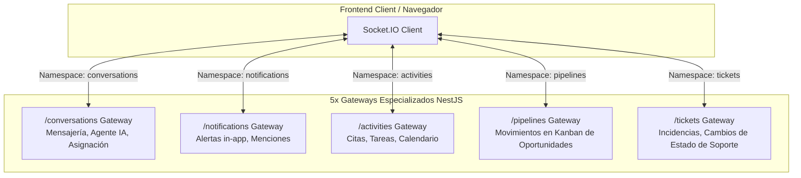

# 💬 Conversaciones, Webchat & Arquitectura WebSockets

## 1. Visión General de la Capa en Tiempo Real
CRM TIBS API adopta un diseño distribuido para eventos en vivo mediante **Socket.IO** (`@nestjs/websockets`, `@nestjs/platform-socket.io`), estructurado en **5 gateways independientes** para evitar la congestión de eventos y asegurar baja latencia en la interfaz de usuario.

---

## 2. Los 5 Gateways de WebSockets

### 2.1. Gateway de Conversaciones (`src/conversations/conversations.gateway.ts`)
* **Namespace:** `/conversations`
* **Transportes:** `websocket`, `polling` (con fallback automático).
* **Eventos Emitidos:**
  * `message_received`: Nuevo mensaje entrante de prospecto o emitido por el agente de IA / operador humano.
  * `bot_status_changed`: Notifica si el agente de IA ha sido encendido o apagado para esa conversación específica.
  * `conversation_assigned`: Notifica la asignación de un operador humano al chat.
  * `tenant_consumption_updated`: Notifica la actualización en tiempo real de los tokens consumidos por el inquilino (disparado vía listener desacoplado `@OnEvent(CONVERSATION_EVENTS.TENANT_CONSUMPTION_UPDATED)`).

### 2.2. Gateway de Notificaciones (`src/notifications/notifications.gateway.ts`)
* **Namespace:** `/notifications`
* **Propósito:** Envío instantáneo de alertas de sistema, recordatorios próximos a vencer, asignación de nuevas oportunidades o menciones internas entre colaboradores.

### 2.3. Gateway de Actividades (`src/activities/activities.gateway.ts`)
* **Namespace:** `/activities`
* **Propósito:** Sincronización en vivo del calendario interno del CRM cuando un compañero de equipo crea, edita o completa una reunión o llamada.

### 2.4. Gateway de Pipelines (`src/pipelines/pipelines.gateway.ts`)
* **Namespace:** `/pipelines`
* **Propósito:** Actualización colaborativa del tablero Kanban de oportunidades. Cuando un ejecutivo arrastra una tarjeta a otra etapa, el cambio se refleja instantáneamente en las pantallas de los demás ejecutivos sin recargar la página.

### 2.5. Gateway de Tickets (`src/tickets/tickets.gateway.ts`)
* **Namespace:** `/tickets`
* **Propósito:** Refresco en tiempo real de la cola de soporte, notificación de tickets escalados por incumplimiento de SLA y nuevos comentarios de clientes.

---

## 3. Módulo de Webchat Público (`src/webchat`)

### 3.1. Widget Incrustable
El módulo de webchat permite a los clientes de CRM TIBS integrar un widget de chat en vivo en sus sitios web corporativos mediante un fragmento de JavaScript ligero:
* `POST /api/webchat/init`: Inicializa una sesión anónima o identificada para el visitante. Crea o recupera un registro en `conversations` vinculado al canal `'webchat'`.
* `POST /api/webchat/message`: Ingesta el mensaje del visitante sin requerir token JWT, aplicando el rate limiter específico para webhooks (`1000 req/min`).

### 3.2. Handoff Humano-IA (Alternancia de Control)
* Por defecto, las conversaciones entrantes son atendidas por el Agente de IA (`bot_active = true`).
* Un operador humano puede tomar el control de la conversación en cualquier momento mediante `PATCH /api/conversations/:id/toggle-bot`.
* Al apagarse el bot, el sistema silencia las respuestas del LLM y permite que el ejecutivo responda manualmente. Si el ejecutivo se desconecta o libera el chat, puede reactivar el bot con un solo clic.
