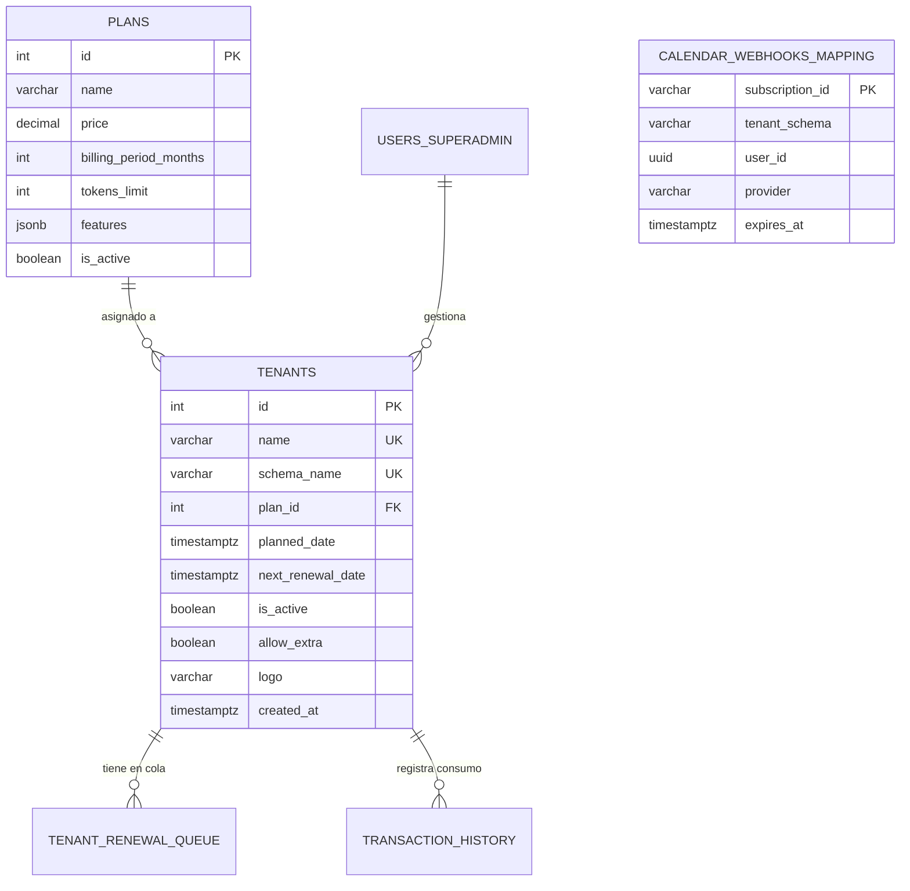

# 🗄️ Diccionario de Base de Datos y Modelos Relacionales

Este documento detalla la estructura física de la base de datos de **CRM TIBS API**, catalogando las tablas maestras compartidas en el esquema `public` y las 32 tablas clonadas de forma aislada dentro de cada esquema `tenant_*`.

---

## 1. Tablas del Esquema Público (`public`)

Las tablas del esquema `public` administran la infraestructura global de la plataforma SaaS y la federación de inquilinos:

### 1.1. Detalle de Tablas en `public`
* **`public.tenants`:** Registro maestro de inquilinos. Almacena el `schema_name` (único, formato `tenant_<slug>`), el estado de activación `is_active`, el plan asociado y las fechas de corte y renovación.
* **`public.plans`:** Catálogo de planes SaaS comerciales. Define el precio, meses de facturación, cuota mensual de tokens de IA (`tokens_limit`) y banderas de funcionalidades en formato JSONB.
* **`public.tenant_renewal_queue`:** Cola de pagos pendientes o suscripciones listas para ser procesadas por el cron job de renovación.
* **`public.transaction_history`:** Bitácora histórica de consumo de tokens, compras adicionales y transacciones de facturación.
* **`public.calendar_webhooks_mapping`:** Tabla global de enrutamiento inverso para webhooks push de calendarios (Google y Microsoft Graph). Permite saber a qué `tenant_schema` y `user_id` corresponde una notificación entrante que no contiene cabecera de tenant.
* **`public.users` (SuperAdmins):** Usuarios administradores globales de la plataforma con rol `superadmin`.

---

## 2. Tablas Aisladas en Esquemas de Inquilino (`tenant_*`)

Cada vez que se aprovisiona una organización, se crea su propio esquema PostgreSQL con el siguiente conjunto de tablas locales:

### 2.1. Gestión de Usuarios y Seguridad
* **`users`:** Usuarios locales del inquilino (administradores y ejecutivos comerciales). Clave primaria UUID, contraseñas encriptadas con bcrypt y token temporal para recuperación de acceso.

### 2.2. Gestión Comercial, Embudos y Oportunidades
* **`tblpipelinescatalog`:** Catálogo de embudos de ventas de la organización.
* **`tblstagescatalog`:** Etapas que componen cada embudo. Incluye orden de visualización (`display_order`), color identificativo y el campo semántico `stage_type`:
  * `0`: En progreso / abierta (`open`)
  * `1`: Ganada / exitosa (`won`)
  * `2`: Perdida / descartada (`lost`)
* **`tblbusinesslines`:** Líneas de negocio o áreas comerciales de la empresa.
* **`tbldeliverytypes`:** Modalidades de entrega de productos o servicios (ej. In-situ, Remoto, Híbrido).
* **`tbllicensingoptions`:** Modalidades de licenciamiento comercial (ej. Perpetua, Suscripción anual, Mensual).
* **`opportunities`:** Entidad central de ventas. Almacena valor estimado, fecha de cierre, cliente asociado, empresa, pipeline, etapa y ejecutivo asignado.
* **`opportunity_products`:** Desglose de partidas de productos/servicios cotizados en cada oportunidad con precio, cantidad y descuento.
* **`opportunity_labels`:** Etiquetas taxonómicas para clasificar oportunidades.
* **`opportunity_contacts`:** Tabla Many-to-Many que vincula múltiples contactos de clientes con una oportunidad.
* **`opportunity_files`:** Archivos adjuntos a la oportunidad (especificaciones, órdenes de compra, propuestas).
* **`opportunity_tracking`:** Registro inmutable de auditoría temporal cada vez que una oportunidad cambia de etapa o valor.

### 2.3. Clientes, Empresas y Agenda
* **`companies`:** Empresas o cuentas corporativas maestras (con razón social, RFC, teléfono y dirección).
* **`clients`:** Contactos y personas físicas vinculadas a una empresa.
* **`activities`:** Citas, reuniones, llamadas y tareas programadas. Incluye campos de sincronización con calendarios externos (`externalEventId`, `externalProvider`, `externalLastSyncedAt`).
* **`activity_contacts`:** Relación Many-to-Many entre actividades y contactos participantes.
* **`type_activities`:** Tipos de actividad (Llamada, Videollamada, Reunión presencial, Correo).
* **`interactions`:** Bitácora de notas y llamadas sostenidas con un cliente.
* **`reminders`:** Recordatorios con alerta horaria para ejecutivos comerciales.
* **`user_calendar_integrations`:** Credenciales OAuth, refresh tokens y suscripciones activas de Google Calendar o Microsoft Outlook para cada usuario del inquilino.

### 2.4. Mesa de Ayuda y Tickets
* **`helpdesks`:** Tableros o departamentos de soporte técnico (Soporte N1, Infraestructura, Facturación).
* **`ticket_stages`:** Etapas de resolución de tickets (Abierto, En Progreso, En Espera de Cliente, Resuelto, Cerrado) con clasificación semántica `stage_type`.
* **`tickets`:** Incidencias de soporte con folio único, asunto, prioridad (`baja`, `media`, `alta`, `urgente`), SLA asignado y cliente relacionado.
* **`ticket_interactions`:** Comentarios públicos de soporte y notas internas de resolución.
* **`helpdesk_cron_configs`:** Configuración de revisión periódica y alertas de SLA para la mesa de ayuda.

### 2.5. Productos y Gastos
* **`products`:** Catálogo de productos y servicios con precio base, código interno y descripción.
* **`product_files`:** Fichas técnicas, catálogos en PDF e imágenes de productos.
* **`expenses`:** Gastos operativos incurridos por los ejecutivos para el seguimiento de oportunidades.

### 2.6. Inteligencia Artificial, RAG y Mensajería
* **`ai_agent_configs`:** Parámetros del agente conversacional (nombre, prompt de sistema, temperatura, proveedor LLM, cuota de tokens).
* **`ai_sub_agents`:** Sub-agentes especializados configurables para transferencias de tareas agénticas.
* **`channel_configs`:** Configuración de canales de entrada (Webchat, WhatsApp).
* **`conversations`:** Hilos de conversación iniciados vía Webchat o API.
* **`messages`:** Mensajes individuales entrantes (prospecto) o salientes (agente IA u operador humano).
* **`dashboard_indicators`:** Configuración personalizada de widgets y KPIs visuales en el dashboard del inquilino.
* **`notifications`:** Notificaciones internas generadas por el sistema.

---

## 3. Convenciones de Diseño y Reglas DDL
1. **Identificadores UUID:** Todas las tablas de negocio en esquemas de inquilino utilizan identificadores únicos universales generados por la función nativa `gen_random_uuid()`.
2. **Timestamps con Zona Horaria:** Todas las columnas de fecha utilizan `timestamptz` para garantizar consistencia horaria en entornos multi-región.
3. **Restricciones de Integridad:** Se aplican reglas `ON DELETE CASCADE` para hijos directos (ej. partidas de oportunidad) y `ON DELETE SET NULL` para relaciones secundarias (ej. empresa en cliente).
