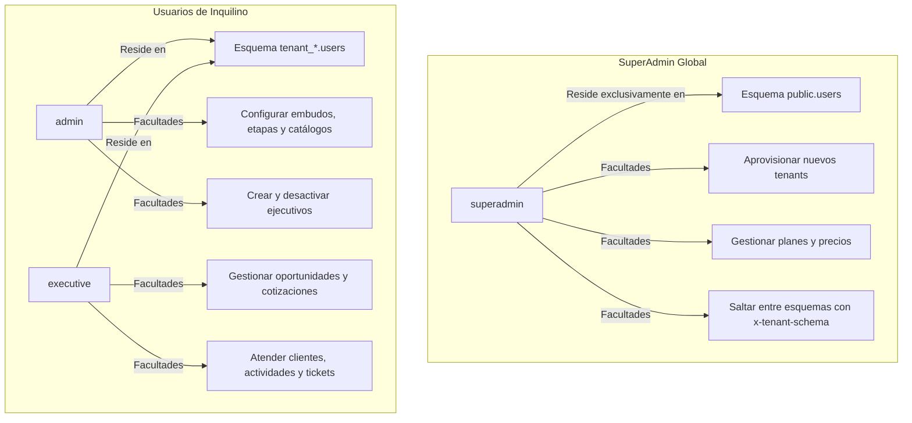

# 👥 Gestión de Usuarios, Roles & Permisos en CRM TIBS API

## 1. Modelo de Control de Acceso Basado en Roles (RBAC)
CRM TIBS API define tres roles jerárquicos tipados a través de `Role` (`src/role.enum.ts`), cuya ubicación física y facultades están estrictamente segregadas para preservar el aislamiento multi-inquilino:



### 1.1. Matriz de Permisos por Rol

| Capacidad / Recurso | `superadmin` | `admin` (Tenant) | `executive` (Tenant) |
| :--- | :---: | :---: | :---: |
| **Aprovisionar tenants y crear esquemas** | ✅ | ❌ | ❌ |
| **Administrar catálogo de planes SaaS** | ✅ | ❌ | ❌ |
| **Modificar cuotas y renovaciones de tenants** | ✅ | ❌ | ❌ |
| **Cambiar de inquilino vía `x-tenant-schema`** | ✅ | ❌ | ❌ |
| **Crear y editar usuarios del propio inquilino**| ❌ | ✅ | ❌ |
| **Configurar pipelines, etapas y helpdesks** | ❌ | ✅ | ❌ |
| **Gestionar oportunidades comerciales propias/equipo**| ❌ | ✅ | ✅ |
| **Generar y enviar cotizaciones PDF** | ❌ | ✅ | ✅ |
| **Atender tickets de soporte técnico** | ❌ | ✅ | ✅ |
| **Sincronizar calendario personal (Google/MS)**| ❌ | ✅ | ✅ |

---

## 2. Aislamiento Físico de SuperAdmins vs Usuarios de Inquilino
Una de las reglas de oro de la arquitectura es que **ningún usuario con rol `superadmin` puede residir en el esquema de una organización**:
1. Los registros de SuperAdmin se almacenan únicamente en la tabla `public.users`.
2. Cuando `TenantMiddleware` procesa una petición dirigida a un inquilino, ejecuta una consulta de saneamiento defensiva:
   ```sql
   DELETE FROM "${tenantSchema}".users WHERE LOWER(role::text) = 'superadmin';
   ```
3. Esto garantiza que si una brecha o inyección local intentara elevar privilegios dentro de un tenant, el usuario no podrá heredar privilegios de administración de la plataforma completa.

---

## 3. Administración de Usuarios (`src/users`)

### 3.1. Creación de Usuarios (`POST /api/users`)
* Requiere rol autenticado vía JWT.
* Valida unicidad de `username` y `email` en el esquema activo.
* Hashea la contraseña con `bcrypt.hash(password, 10)`.
* Permite asignar el rol `executive` o `admin`. Se prohíbe la auto-asignación de `superadmin` en rutas de tenant.

### 3.2. Actualización de Estado (`PATCH /api/users/:id/status`)
* Permite a un administrador suspender el acceso de un colaborador (`isActive: false`) sin eliminar su histórico comercial (oportunidades cerradas, tickets atendidos, interacciones y llamadas).
* La desactivación invalida inmediatamente cualquier intento de nuevo login en `AuthService.validateUser()`.

### 3.3. Subida de Fotos de Perfil (`POST /api/users/:id/profile-image`)
* Utiliza `FileInterceptor('file')` con Multer para recibir imágenes (JPEG, PNG, WebP).
* Almacenamiento agnóstico:
  * Si `STORAGE_TYPE === 'azure'`, el archivo se sube al contenedor de Azure Blob Storage mediante `@azure/storage-blob`.
  * Si `STORAGE_TYPE === 'local'`, se almacena en el directorio `uploads/profiles/`.
* Normaliza las barras de ruta para compatibilidad entre sistemas operativos Windows y Linux (`path.replace(/\\/g, '/')`).
* Actualiza la columna `profileImageUrl` del usuario y retorna el objeto actualizado.
