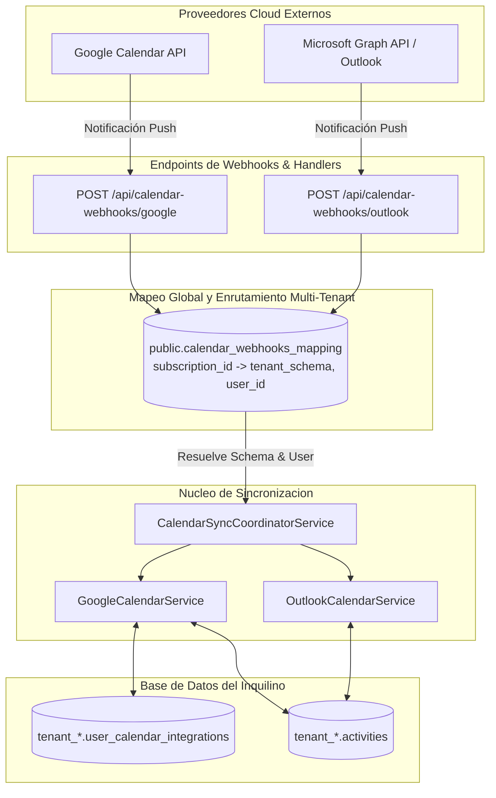

# 📅 Integraciones de Calendario Externo (Google & Outlook)

## 1. Visión General de la Sincronización de Agenda
CRM TIBS API ofrece sincronización bidireccional continua entre la agenda de actividades del CRM y los dos principales proveedores corporativos de calendario: **Google Calendar** y **Microsoft Outlook** (Microsoft Graph API). La integración con Apple iCloud ha sido deshabilitada para garantizar máxima compatibilidad y seguridad OAuth 2.0 nativa.



---

## 2. Proveedores Soportados y Métodos de Autenticación

### 2.1. Google Calendar (`GoogleCalendarService`)
* **Autenticación:** Flujo estándar OAuth 2.0 con alcances `calendar.events` y `calendar.readonly`.
* **Tokens:** Almacena `accessToken`, `refreshToken` y `expiresAt` en `user_calendar_integrations`. El servicio renueva automáticamente los tokens expirados utilizando el `refreshToken`.
* **Webhooks Push:** Registra un canal de observación (`watch`) con Google. Cuando ocurre una modificación en el calendario de Google, Google envía un webhook a `/api/calendar-webhooks/google` con la cabecera `X-Goog-Channel-ID`.

### 2.2. Microsoft Outlook (`OutlookCalendarService`)
* **Autenticación:** OAuth 2.0 sobre Microsoft identity platform (Azure Active Directory / Entra ID) utilizando Microsoft Graph API v1.0 (`Calendars.ReadWrite`).
* **Suscripciones de Webhook:** Crea una suscripción en Graph API apuntando a `/api/calendar-webhooks/outlook`. Soporta la validación de handshake inicial (`validationToken`) y procesa notificaciones de cambios incrementales con `syncToken` delta.

---

## 3. El Problema del Enrutamiento Multi-Tenant en Webhooks Inbound
Los proveedores de calendario externos (Google y Microsoft) envían solicitudes HTTP POST directas a los webhooks del servidor **sin cabeceras Bearer JWT ni conocimiento de qué tenant_schema de PostgreSQL es el dueño del evento**.

Para resolver este desafío arquitectónico sin romper el aislamiento multi-tenant:
1. **Tabla Global de Mapeo (`public.calendar_webhooks_mapping`):**
   * Cada vez que un usuario conecta su calendario y se crea una suscripción de webhook, se inserta un registro en la tabla compartida de `public`:
     ```sql
     CREATE TABLE public.calendar_webhooks_mapping (
       subscription_id varchar(255) PRIMARY KEY,
       tenant_schema varchar(63) NOT NULL,
       user_id uuid NOT NULL,
       provider varchar(20) NOT NULL,
       expires_at timestamptz NULL
     );
     ```
2. **Resolución Inversa del Contexto:**
   * Al recibir la notificación en `CalendarWebhooksController`, el controlador extrae el `subscriptionId` (o `channelId`).
   * Consulta `public.calendar_webhooks_mapping` para obtener el `tenant_schema` y el `user_id`.
   * Envuelve la ejecución de sincronización dentro de `TenantContextService.run({ tenantSchema, userId }, async () => { ... })`.
   * De esta forma, el query runner de TypeORM conmuta dinámicamente al esquema correcto del cliente y actualiza las actividades en `activities` sin riesgo de mezclar datos entre inquilinos.

---

## 4. Coordinador de Sincronización (`CalendarSyncCoordinatorService`)
* **De CRM a Calendario Externo:** Al crear o modificar una actividad en el CRM, el coordinador invoca el método `upsertEvent()` del proveedor correspondiente, guardando el identificador devuelto en `activities.externalEventId`.
* **De Calendario Externo a CRM:** Al procesar un webhook entrante, el coordinador compara las fechas y descripciones del evento externo contra la tabla `activities`. Si la cita no existe, la crea; si fue modificada en el teléfono del usuario, actualiza la actividad en el CRM.
