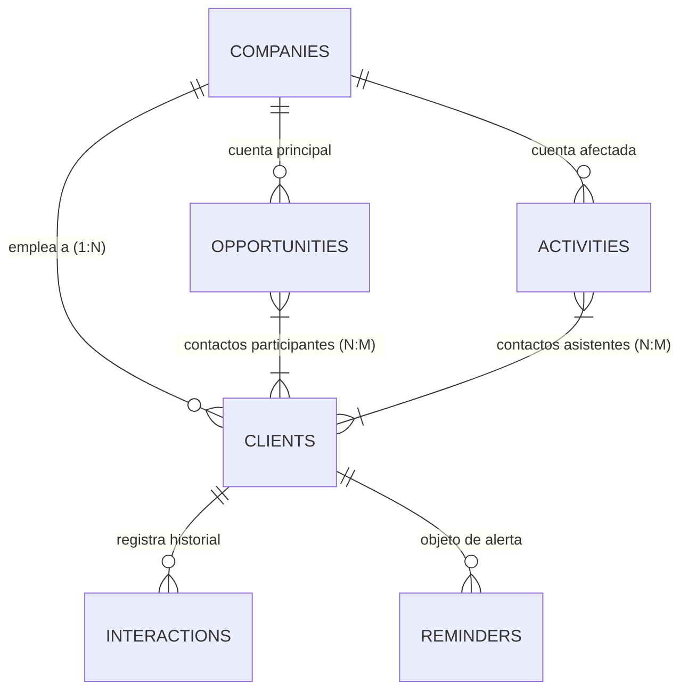

# 👥 Módulo de Clientes, Empresas & CRM

## 1. Visión General del Modelo de Relaciones
El núcleo relacional de CRM TIBS API estructura la información de contactos comerciales separando formalmente a las personas físicas (**Clientes**) de las organizaciones corporativas (**Empresas**), soportando relaciones jerárquicas tanto 1:N como N:M para oportunidades y actividades.

---

## 2. Entidades Principales

### 2.1. Empresas (`Company` - `companies`)
* Representa la entidad legal o comercial con la que se cierran contratos.
* Almacena razón social (`nombre`), identificador fiscal (`rfc`), dominio o correo principal, teléfono corporativo, sitio web y dirección fiscal completa.
* Durante la inicialización del sistema (`onApplicationBootstrap` en `app.module.ts`), se ejecuta una migración automática que analiza clientes existentes con el campo de texto libre `empresa` y los agrupa o vincula automáticamente a registros normalizados en `companies`.

### 2.2. Clientes / Contactos (`Client` - `clients`)
* Representa a los individuos que fungen como tomadores de decisión, compradores o contactos técnicos.
* Atributos: `nombre`, `email`, `telefono` (en formato internacional), puesto o rol en la empresa, y la clave foránea `companyId`.
* Si una empresa se da de baja, la relación está configurada con `ON DELETE SET NULL` para preservar el expediente del contacto.

---

## 3. Bitácora de Interacciones (`src/interactions`)
* Permite a los ejecutivos registrar cada punto de contacto no estructurado con un cliente (minutas de llamadas, acuerdos verbales, notas de seguimiento, correos recibidos).
* Cada interacción vincula:
  * `clientId`: Contacto con quien se sostuvo la comunicación.
  * `userId`: Ejecutivo comercial autor de la nota.
  * `tipo`: Modalidad de contacto (`llamada`, `correo`, `reunion`, `nota`).
  * `contenido`: Texto detallado del intercambio.
  * `createdAt`: Registro temporal inmutable.

---

## 4. Actividades y Gestión de Agenda (`src/activities`)
El módulo de actividades organiza la agenda operativa de los ejecutivos:
* **Tipos de Actividad (`type_activities`):** Catálogo personalizable (ej. Llamada de prospección, Demostración en vivo, Envío de propuesta, Firma de contrato).
* **Vinculación Múltiple:** Una actividad puede estar asociada simultáneamente a una Oportunidad (`opportunityId`), una Empresa (`companyId`) y múltiples contactos a través de la tabla intermedia `activity_contacts`.
* **Sincronización Bidireccional de Calendario:**
  * Dispone de los campos `externalEventId`, `externalProvider` (`google`, `outlook`, `icloud`) y `externalLastSyncedAt`.
  * Cada vez que se crea o actualiza una actividad, el `CalendarSyncCoordinatorService` propaga la cita hacia el calendario externo conectado del usuario.
* **Tiempo Real:** Dispone de un gateway WebSocket dedicado en el namespace `/activities` (`ActivitiesGateway`) para actualizar en vivo los calendarios y cronogramas de los demás integrantes del equipo.

---

## 5. Motor de Recordatorios (`src/reminders`)
* Permite programar alertas con anticipación para tareas pendientes (ej. "Llamar a seguimiento el jueves a las 10:00 AM").
* Los recordatorios incluyen fecha y hora límite, ejecutivo asignado, estado (`pendiente` / `atendido`) y enlace directo a la ficha del cliente u oportunidad.
