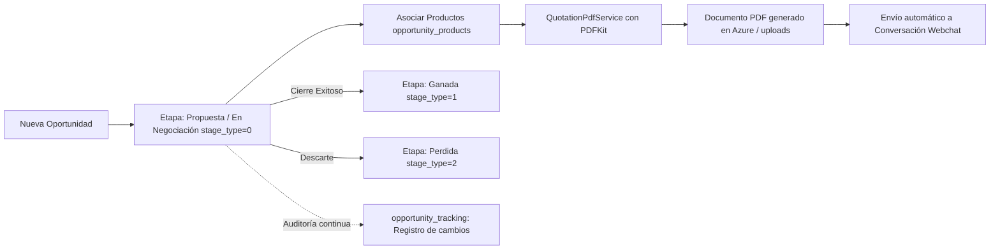

# 💼 Módulo de Oportunidades, Pipelines & Cotizaciones

## 1. Visión General del Flujo Comercial
El módulo de oportunidades es el núcleo transaccional comercial de CRM TIBS API. Permite a los ejecutivos gestionar prospectos calificados a través de embudos de venta dinámicos (Pipelines), registrar productos o servicios cotizados, dar seguimiento cronológico de cambios de etapa y generar propuestas formales en formato PDF.



---

## 2. Embudos y Etapas Semánticas (`src/pipelines`, `src/stages`)

### 2.1. Clasificación Semántica de Etapas (`stage_type`)
A diferencia de los CRMs convencionales que dependen únicamente del nombre en texto de la etapa, CRM TIBS clasifica las etapas mediante el campo entero `stage_type` en `tblstagescatalog`:
* `0` (`OPEN`): Etapa activa de negociación (ej. Prospección, Calificación, Demostración, Envío de Propuesta).
* `1` (`WON`): Etapa de cierre exitoso / venta ganada (ej. Cerrada Ganada, Contrato Firmado, Venta Exitosa). Al alcanzar esta etapa, el valor de la oportunidad suma formalmente a las métricas de ingresos devengados.
* `2` (`LOST`): Etapa de descarte / venta perdida (ej. Cerrada Perdida, Descartada por Precio, Cancelada). Requiere registrar el motivo del descarte.

### 2.2. Tablero Kanban en Tiempo Real (`PipelinesGateway`)
* Cualquier cambio de etapa o reordenamiento de tarjetas ejecutado por un usuario dispara un evento vía WebSocket en el namespace `/pipelines` hacia todos los clientes conectados del mismo tenant:
  ```typescript
  this.server.emit('opportunity_stage_changed', { opportunityId, newStageId, userId });
  ```

---

## 3. Generación Automatizada de Cotizaciones en PDF (`QuotationPdfService`)
Ubicado en `src/opportunities/quotation-pdf.service.ts`, implementa un motor de maquetación tipográfica vectorial utilizando **PDFKit**:

### 3.1. Capacidades del Generador:
* **Identidad Visual Corporativa:** Incorpora automáticamente el logotipo del tenant (`Tenant.logo`), colores institucionales y datos fiscales del emisor.
* **Encabezado y Datos del Cliente:** Datos de la empresa (`Company`), persona de contacto (`Client`), RFC, dirección y fecha de vencimiento de la oferta.
* **Tabla de Partidas Dinámica:** Renderiza código, descripción del producto, cantidad, precio unitario, descuento aplicado e importe neto.
* **Cálculo de Impuestos y Totales:** Subtotal, IVA (16%) y total general formateados en moneda nacional.
* **Condiciones Comerciales y Firmas:** Términos de pago, validez de la oferta y áreas de rúbrica digital.

### 3.2. Estrategia de Entrega y Fallback:
1. **Ruta Local vs Azure:** Si `STORAGE_TYPE === 'azure'`, el PDF se sube directamente a Azure Blob Storage en la ruta `uploads/quotations/:opportunityId/:filename`. En caso contrario, se escribe en disco local.
2. **Fallback Inteligente:** Si se solicita la descarga de un PDF cuyo nombre exacto cambió o fue regenerado, el middleware de fallback de `main.ts` localiza automáticamente el archivo PDF más reciente dentro de la carpeta de la oportunidad.
3. **Envío Omnicanal:** Mediante `POST /api/opportunities/:id/quotation-pdf/send`, el sistema no solo genera el documento sino que lo inyecta como mensaje multimedia directamente en la conversación activa de Webchat del cliente.

---

## 4. Auditoría y Registro Histórico (`OpportunityTrackingsModule`)
Cada mutación de una oportunidad (cambio de etapa, modificación de monto estimado o reasignación de ejecutivo) inserta un registro inmutable en `opportunity_tracking`:
* `opportunity_id`: Identificador de la oportunidad.
* `user_id`: Usuario responsable del cambio.
* `previous_stage_id` y `new_stage_id`: Transición de etapa observada.
* `comment`: Nota explicativa del cambio.
* `created_at`: Marca temporal exacta con zona horaria.
* Esto permite alimentar las gráficas de velocidad de ventas y embudo de conversión en el módulo de reportes.
