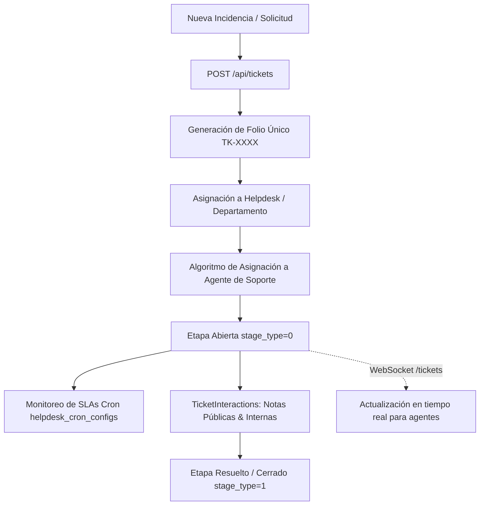

# 🎫 Módulo de Tickets & Mesa de Ayuda (Helpdesk)

## 1. Visión General del Sistema de Soporte
CRM TIBS API incorpora una solución completa de mesa de ayuda (Helpdesk) integrada con la cartera de clientes, permitiendo la gestión de incidencias, tickets de soporte post-venta, solicitudes de servicio y seguimiento de acuerdos de nivel de servicio (SLAs).

---

## 2. Entidades Principales

### 2.1. Tableros de Mesa de Ayuda (`Helpdesk` - `helpdesks`)
* Permite segmentar el soporte en múltiples departamentos o colas de atención (ej. Soporte Técnico Nivel 1, Facturación & Cobranza, Infraestructura Cloud).
* Define configuraciones de auto-asignación (Round-Robin o por carga de trabajo) y parámetros generales de notificación.

### 2.2. Etapas de Resolución (`TicketStage` - `ticket_stages`)
* Al igual que las etapas de venta, las etapas de soporte cuentan con clasificación semántica:
  * `stage_type = 0` (`OPEN`): El ticket se encuentra activo y consumiendo tiempo de SLA (ej. "Nuevo", "En Análisis", "En Espera de Proveedor").
  * `stage_type = 1` (`RESOLVED` / `CLOSED`): El ticket ha sido solucionado satisfactoriamente o archivado (ej. "Resuelto", "Cerrado"). Al alcanzar esta etapa, se detiene el cómputo de SLA.

### 2.3. Tickets (`Ticket` - `tickets`)
* Atributos principales:
  * `folio`: Código alfanumérico único para referencia del cliente y búsqueda rápida.
  * `asunto` y `descripcion`: Detalle técnico de la solicitud.
  * `prioridad`: Clasificación de severidad (`baja`, `media`, `alta`, `urgente`).
  * `sla_due_date`: Fecha y hora máxima de resolución calculada según la matriz de prioridad.
  * `client_id` y `company_id`: Vinculación directa con la ficha del cliente en el CRM.
  * `assigned_user_id`: Agente de soporte responsable de la atención.

---

## 3. Interacciones y Bitácora del Ticket (`TicketInteractionsModule`)
El módulo `ticket-interactions` gestiona el hilo de conversación de cada incidencia:
* **Comentarios Públicos:** Mensajes visibles para el cliente final, utilizados para solicitar aclaraciones o reportar avances.
* **Notas Internas Privadas:** Anotaciones de uso exclusivo para el equipo técnico (diagnósticos, credenciales temporales, bitácoras de pruebas) que nunca son visibles para el solicitante.
* **Adjuntos de Soporte:** Capturas de pantalla, archivos de log y documentos técnicos de diagnóstico.

---

## 4. Monitoreo de SLAs y Notificaciones en Tiempo Real
* **Cron de SLAs (`helpdesk_cron_configs`):** Proceso en segundo plano que evalúa periódicamente los tickets abiertos próximos a vencer su plazo de resolución. Si un ticket rebasa el 80% del tiempo de SLA sin resolver, escala la prioridad y genera una notificación al supervisor.
* **TicketsGateway (`src/tickets/tickets.gateway.ts`):** Gateway de Socket.IO en el namespace `/tickets` que transmite eventos de creación de tickets, reasignaciones y cambios de etapa hacia los paneles de los operadores en vivo.
