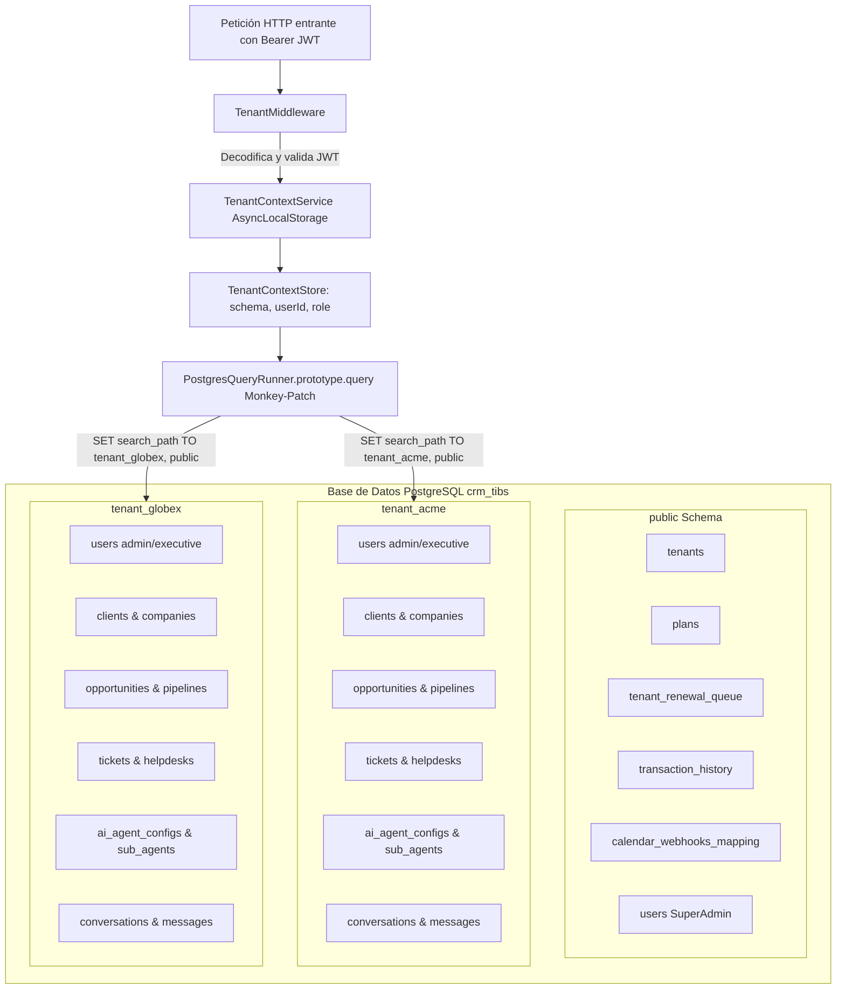

# 🏢 Arquitectura Multi-Tenancy en CRM TIBS API

## 1. Visión General y Estrategia de Aislamiento
CRM TIBS API implementa una arquitectura **Database-Per-Schema** (Multi-Tenancy por Esquemas Dinámicos de PostgreSQL). Todos los datos pertenecientes a una organización residen en un esquema propio llamado `tenant_<slug>`, mientras que la administración central de la plataforma, el catálogo de planes, la cola de renovaciones y el mapeo de webhooks globales residen en el esquema `public`.



---

## 2. Componentes Clave del Sistema Multi-Tenant

### 2.1. TenantMiddleware (`src/tenancy/tenant.middleware.ts`)
* Se ejecuta en todas las rutas del servidor (`forRoutes({ path: '*path', method: RequestMethod.ALL })`).
* Extrae el Bearer token del header `Authorization` y realiza una **verificación criptográfica real** mediante `jwt.verify(token, secret)`.
* Si el rol del usuario es `superadmin`, el esquema base se establece en `'public'`, pero se le permite cambiar dinámicamente de inquilino enviando la cabecera `x-tenant-schema`.
* Para usuarios normales, el esquema se extrae directamente del payload firmado `decoded.tenant`.
* **Validación de Tenant Activo con Caché LRU:** Para no saturar PostgreSQL consultando `public.tenants` en cada petición HTTP, el middleware consulta una caché en memoria (TTL de 60 segundos con `@nestjs/cache-manager`). Si el tenant no existe o está inactivo (`is_active = false`), rechaza la petición de inmediato con `403 Forbidden`.
* **Limpieza de SuperAdmins:** Asegura que en el esquema del tenant no existan usuarios con rol `superadmin` mediante una comprobación defensiva.

### 2.2. TenantContextService (`src/tenancy/tenant-context.service.ts`)
* Utiliza la API nativa de Node.js `AsyncLocalStorage<TenantContextStore>` para garantizar que las peticiones HTTP concurrentes mantengan su contexto de inquilino completamente aislado sin colisiones de hilos.
* Métodos principales:
  * `run(store, callback)`: Ejecuta la función dentro del contexto de la petición actual.
  * `getTenantSchema()`: Retorna el esquema resuelto o `'public'` si no hay contexto activo (ej. en cron jobs o tareas de bootstrap).
  * `validateSchemaName(schemaName)`: Valida regex estricta `^[a-z0-9_]+$`, longitud máxima de 63 caracteres y prohíbe esquemas reservados del sistema (`pg_`, `information_schema`, `pg_catalog`).
  * `generateSlug(tenantName)`: Genera un slug estandarizado con prefijo `tenant_` eliminando caracteres especiales.

### 2.3. Monkey-Patch de TypeORM (`patchTypeORMQueryRunnerForMultiTenancy`)
Para evitar tener que instanciar múltiples `DataSource` de TypeORM o recrear conexiones, el sistema decora dinámicamente `PostgresQueryRunner.prototype.query`:
```typescript
PostgresQueryRunner.prototype.query = async function (query, parameters, useRunInTransaction) {
  const targetSchema = TenantContextService.getTenantSchema();
  
  if (!query.startsWith('SET search_path') && !query.startsWith('BEGIN') && ...) {
    if ((this as any).__tenant_schema__ !== targetSchema) {
      if (targetSchema === 'public') {
        await originalQuery.call(this, `SET search_path TO public`);
      } else {
        await originalQuery.call(this, `SET search_path TO "${targetSchema}", public`);
      }
      (this as any).__tenant_schema__ = targetSchema;
    }
  }
  // Reemplazo defensivo de uuid_generate_v4() por gen_random_uuid() nativo
  if (typeof query === 'string' && query.includes('uuid_generate_v4()')) {
    query = query.replace(/uuid_generate_v4\(\)/g, 'gen_random_uuid()');
  }
  return originalQuery.call(this, query, parameters, useRunInTransaction);
};
```
* Esta técnica asegura compatibilidad con poolers de conexión (como PgBouncer o Supabase) forzando el `search_path` por cada instancia de query runner.

### 2.4. Aprovisionamiento Automatizado (`src/tenancy/tenant-provisioner.service.ts`)
Cuando un SuperAdmin solicita la creación de un nuevo inquilino vía `POST /api/tenants/provision`:
1. Inicia una transacción PostgreSQL atómica (`BEGIN`).
2. Valida la disponibilidad del slug de esquema en `information_schema.schemata`.
3. Ejecuta `CREATE SCHEMA IF NOT EXISTS "${schemaName}"`.
4. Ejecuta el DDL completo creando las 32 tablas locales del tenant con sus índices y llaves foráneas.
5. Siembra catálogos iniciales por defecto (Pipelines por defecto, etapas de venta, líneas de negocio, tipos de entrega, estados de ticket y canales de IA).
6. Crea el usuario administrador inicial del tenant con contraseña temporal criptográficamente segura.
7. Registra el inquilino en `public.tenants` asociando su plan SaaS correspondiente.
8. Confirma la transacción con `COMMIT`. En caso de cualquier error, ejecuta `ROLLBACK` y elimina el esquema creado.

---

## 3. Seguridad y Consideraciones
* **Inyección SQL:** Todos los nombres de esquemas están parametrizados y envueltos en comillas dobles `"${schemaName}"`, impidiendo ataques de evasión de identificadores.
* **Aislamiento Total:** Ninguna consulta ejecutada en nombre de un tenant puede acceder a tablas de otro tenant salvo las tablas públicas explícitamente autorizadas.
