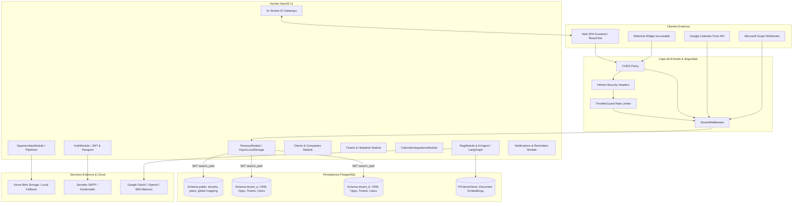

# 🏢 CRM TIBS API — Hub Maestro de Arquitectura Backend

**CRM TIBS API** es el motor backend empresarial para la gestión integral de relaciones con clientes, prospección comercial, ciclo de vida de oportunidades, generación de cotizaciones, soporte técnico mediante tickets, integración omnicanal en tiempo real y asistencia cognitiva mediante agentes de inteligencia artificial y RAG.

---

## 🏗️ 1. Diagrama de Arquitectura Global



---

## 🛠️ 2. Stack Tecnológico Principal

| Capa | Tecnología | Versión | Propósito Arquitectónico |
| :--- | :--- | :--- | :--- |
| **Framework** | NestJS | `11.0.1` | Arquitectura modular, inyección de dependencias y decoradores. |
| **Plataforma HTTP** | Express | `5.0.0` | Servidor base y middleware HTTP. |
| **Lenguaje** | TypeScript | `5.7.3` | Tipado estricto y compilación moderna. |
| **ORM** | TypeORM | `0.3.27` | Modelado relacional, DataMapper y decoradores de persistencia. |
| **Driver BD** | `pg` (node-postgres) | `8.16.3` | Pool de conexiones a PostgreSQL nativo. |
| **IA & Orquestación** | LangChain & LangGraph | `1.2.3` / `1.4.8` | Grafos de decisión agéntica y flujo de herramientas. |
| **Embeddings & LLMs**| Google GenAI & Watsonx | `2.2.0` | Embeddings vectoriales y modelos generativos. |
| **Búsqueda Vectorial**| PGVectorStore | `@langchain/community` | Búsqueda semántica de documentos y RAG. |
| **WebSockets** | Socket.IO | `4.8.3` | Comunicación bidireccional en tiempo real. |
| **Generación PDF** | PDFKit | `0.19.1` | Motor de maquetación y renderizado de cotizaciones en PDF. |
| **Cloud Storage** | Azure Storage Blob | `12.32.0` | Almacenamiento escalable de archivos y cotizaciones. |
| **Seguridad** | Helmet & Bcrypt | `8.3.0` / `6.0.0` | Cifrado de contraseñas y sanitización de cabeceras HTTP. |

---

## 📁 3. Estructura del Código Fuente (`src/`)

```
src/
├── activities/             # Tareas, reuniones, llamadas y gateway WebSocket
├── auth/                   # Autenticación JWT, Passport, login y recuperación de contraseña
├── calendar-integrations/  # Google Calendar, Outlook Graph, iCloud CalDAV y webhooks
├── clients/                # Directorio de clientes, datos fiscales y relaciones comerciales
├── common/                 # Filtros globales de excepción, interceptores, loggers y eventos
├── companies/              # Empresas (cuentas maestras) con contactos asociados
├── conversations/          # Bandeja de entrada omnicanal, orquestador de IA y Socket.IO
├── database/               # Configuración de DataSource TypeORM para migraciones
├── expenses/               # Gastos operativos vinculados a oportunidades comerciales
├── interactions/           # Historial cronológico de interacciones con clientes
├── mail/                   # Servicio de envío de correos transaccionales SMTP
├── notifications/          # Notificaciones in-app con gateway en tiempo real
├── opportunities/          # Oportunidades, cotizaciones PDF (PDFKit), productos y etiquetas
├── opportunity-trackings/  # Auditoría y tracking cronológico de etapas de oportunidades
├── pipelines/              # Embudos de venta, etapas personalizadas y gateway Kanban
├── plans/                  # Catálogo de planes SaaS, precios y límites de cuota
├── products/               # Catálogo de productos y servicios con listas de precios
├── rag/                    # Ingestión de documentos PDF, generación de embeddings y búsqueda vectorial
├── reminders/              # Recordatorios automáticos para ejecutivos y clientes
├── reports/                # Indicadores de rendimiento del dashboard y analítica
├── stages/                 # Catálogo global de etapas de venta
├── storage/                # Abstracción de almacenamiento (Local filesystem / Azure Blob)
├── subscriptions/          # Control de suscripciones de inquilinos y cron de renovaciones
├── tenancy/                # Middleware de multi-tenancy, AsyncLocalStorage y aprovisionador
├── tenants/                # CRUD de organizaciones, actualización de planes y consumo
├── ticket-interactions/    # Comentarios internos y notas de resolución de tickets
├── tickets/                # Mesa de ayuda, etapas de soporte, prioridades y cron de SLAs
├── users/                  # Administración de usuarios, roles (RBAC) y fotos de perfil
├── webchat/                # Widget público de chat embebido y sesión de prospectos
├── app.module.ts           # Módulo raíz que integra los 28 submódulos
├── main.ts                 # Bootstrap de NestJS, Swagger, CORS, Helmet y uploads
└── role.enum.ts            # Definición de roles (superadmin, admin, executive)
```

---

## ⚙️ 4. Variables de Entorno Clave (`.env`)

| Variable | Descripción | Tipo | Obligatoria |
| :--- | :--- | :---: | :---: |
| `PORT` | Puerto de escucha del servidor NestJS. | `number` | No (default: 3000) |
| `DB_HOST` | Host del servidor PostgreSQL. | `string` | **Sí** |
| `DB_PORT` | Puerto de conexión a PostgreSQL. | `number` | **Sí** (5432) |
| `DB_USERNAME` | Usuario administrador de PostgreSQL con privilegios DDL. | `string` | **Sí** |
| `DB_PASSWORD` | Contraseña de PostgreSQL. | `string` | **Sí** |
| `DB_DATABASE` | Nombre de la base de datos principal (`crm_tibs`). | `string` | **Sí** |
| `JWT_SECRET` | Clave secreta simétrica para firma y verificación de tokens. | `string` | **Sí** |
| `STORAGE_TYPE` | Tipo de almacenamiento (`local` o `azure`). | `string` | No (default: local) |
| `AZURE_STORAGE_CONNECTION_STRING` | Cadena de conexión para Azure Blob Storage. | `string` | Si STORAGE_TYPE=azure |
| `AZURE_STORAGE_CONTAINER` | Nombre del contenedor de blobs en Azure (`uploads`). | `string` | No |
| `ALLOWED_ORIGINS` | Orígenes CORS permitidos separados por coma. | `string` | No |
| `GOOGLE_CLIENT_ID` | Identificador de cliente OAuth 2.0 para Google Calendar. | `string` | Para Google Sync |
| `GOOGLE_CLIENT_SECRET` | Clave secreta OAuth 2.0 de Google. | `string` | Para Google Sync |
| `MICROSOFT_CLIENT_ID` | Application ID de Azure AD para Microsoft Outlook Graph. | `string` | Para Outlook Sync |
| `MICROSOFT_CLIENT_SECRET`| Secreto de aplicación de Azure AD. | `string` | Para Outlook Sync |

---

## 🧭 5. Enlaces Bidireccionales a Notas Técnicas Especializadas

* [[CRM TIBS - Multi-Tenancy Architecture]] — Aislamiento Database-Per-Schema, `TenantMiddleware`, `TenantContextService` y parche de TypeORM.
* [[CRM TIBS - Database Schema & Data Models]] — Diccionario completo de tablas en `public` y esquemas de inquilino.
* [[CRM TIBS - Autenticacion, JWT & Seguridad]] — Flujo JWT, autenticación, rate limiting y reseteo de contraseñas.
* [[CRM TIBS - Gestion de Usuarios, Roles & Permisos]] — Modelo de roles RBAC, aislamiento de SuperAdmin y usuarios locales.
* [[CRM TIBS - Aprovisionamiento de Tenants, Planes SaaS & Renovaciones]] — Creación de tenants, clonación DDL, planes y ciclo de vida.
* [[CRM TIBS - Modulo de Oportunidades, Pipelines & Cotizaciones]] — Flujo comercial, etapas semánticas y cotizador en PDF.
* [[CRM TIBS - Modulo de Clientes, Empresas & CRM]] — Directorio de clientes, empresas, contactos M2M y actividades.
* [[CRM TIBS - Modulo de Tickets & Helpdesk]] — Mesa de ayuda multicanal, SLAs y resolución de soporte.
* [[CRM TIBS - AI Agent, RAG & LangGraph]] — Motor de IA agéntica, LangGraph, herramientas y vector store.
* [[CRM TIBS - Conversaciones, Webchat & WebSockets]] — Mensajería omnicanal y los 5 Gateways de Socket.IO.
* [[CRM TIBS - Integraciones de Calendario Externo]] — Sincronización con Google, Outlook e iCloud.
* [[MOC - Mapa de Contenidos Backend]] — Mapa maestro de navegación de la bóveda.
* [[Diccionario de Entidades y Modelos]] — Diccionario de tipos, DTOs y entidades TypeORM.
* [[Matriz de Endpoints y Servicios]] — Mapeo exhaustivo de rutas y controladores.
* [[Guia de Contexto para Agentes de IA (MCP Retrieval)]] — Protocolo de consulta para agentes de IA vÃa MCP.
